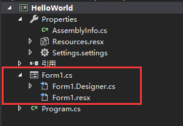

## 1、语言概述

- 面向对象（所有的类型都是对象）：所有数据类型都集成自object类
-  没有单独的头文件，也不要求按特定顺序声明方法和类型。即可以在代码定义之前引用已经定义的类型和方法

## 2、.NET平台体系

C#必须在.NET虚机中运行（类似Java的JVM）

### .NET环境包括：

1. 公共语言运行时的虚执机系统
2. 一组统一的类库

### C#的编译结果

符合CLI规范的中间语言（IL），IL代码和对应的资源（位图、字符串）存储在.dll文件中。也就是说，C#的编译结果是.dll文件。

> 注释：
>
> 位图：windows中的一种图像文件格式，由像素阵列组成

### C#的编译过程

1. .dll（程序集）加载到CLR
2. CLR实时编译，将IL代码转换为本机指令，同时提供自动垃圾回收、异常处理和资源管理相关服务(面向特定系统的“托管代码”)

### .NET平台的互操作性

1. 支持CTS规范的语言可以交互
2. 一个.dll可能包含不同.NET语言编写的模块
3. 不同模块之间类型可以互相引用

### .NET的命名空间

1. 命名空间可以理解为C中的头文件，python中的第三方库
2. 命名空间通过关键字**using**进行引用
3. 命名空间引用之后可以直接使用其中的类，而不需要在类前面加上命名空间的名字
4. 命名空间提供各种实用功能，包括文件输入输出、字符串控制、XML分析、Web应用程序框架和Windows窗体控件等等
5. 命名空间常用来处理很多零碎的工作

## 3、Hello world

```c#
using System;
class Hello
{
    static void Main(string[] args)
    {
        Console.WriteLine("Hello, World");
    }
}
```

## 4、语言特性

### 命名空间

- 类似C语言中的头文件.h
- 命名空间通过关键字namespace定义
- 命名空间内部可以定义很多类的属性及其方法
- 在其他.cs文件中使用using关键字来引用命名空间中的类

### 类

- 类具有属性和方法
- 定义类的同时可以同时创建这个类的对象
- 允许使用关键字**partial**对类进行局部定义：将结构、类、接口分成几个部分，分别实现在几个不同的.cs文件中

### 方法

- 方法分为**构造方法**和**用户方法**
- 构造方法与类名同名，在创建类的对象的时候调用，**不可缺少！**

### 访问修饰符

- 用于控制类、属性、方法的访问权限
- 常用有五个：
- - private（私有的）（默认）
  - public（公共的）
  - protected（受保护的）
  - internal（内部的）
  - protect internal（受保护内部的）

### 界面与后台分离!!!!!

> C#一个很重要很有特点的特性

- 前端代码和后端代码的命名空间和类名相同
  - 
- 使用C#类的局部定义特性


## 5、例子

D:\Typora-\1.语言学习\C#\如何开始进行上位机程序编程.md
