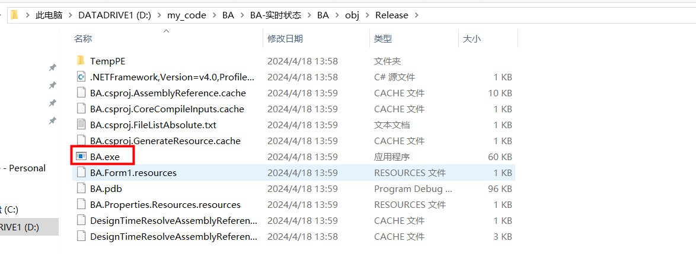

> 优秀博文：[c#串口编程（傻瓜教程，手把手教你学会）_c# 串口编程-CSDN博客](https://blog.csdn.net/ba_wang_mao/article/details/113642066)

## 1、项目/解决方案创建

#### 点击创建对应项目

#### 选择项目类型为Vindows窗体应用(.NET Framework)

#### 关于控件工具箱

**打开工具箱**

****

**选择工具箱项可以配置工具箱中的控件种类**

## 2、如何打包exe文件

**保存文件**

**设置Release、CPU类型**

**生成解决方案**

**在Release文件夹中找到对应的.exe文件**

## 3、代码框架解读

#### 程序主函数入口

在 Program.cs中

## 4、其他注意项

### **4.1 不要在Form1.Designer.cs中对窗口控件进行初始化**

 	该代码为生成器自动生成，每次修改前端界面都会被重置掉，所以控件初始化还是要在Form.cs中进行

### 4.2 窗口字体模糊的解决方案

[C# Form运行时，窗体界面模糊，比设计UI时要模糊_c# 界面模糊-CSDN博客](https://blog.csdn.net/qq_44839815/article/details/121998618)

如图，图片很糊

**问题**
在Visual Studio设计窗体时，显示正常，但是一旦运行后窗体上的对象和字体会变得很模糊，缩放也出现了问题

**解决方法：**
修改项目的配置文件，使项目运行时自动检测屏幕分辨率，在高分辨率屏幕禁用系统缩放，应用程序清单文件里有对禁用高分屏自动缩放的支持，只是被注释掉了，我们去取消注释即可。

1、右击当前项目，点击添加-类

2、找到应用程序清单文件项，点击添加

3、打开添加的这个文件，找到下图中这个位置，取消注释即可

### 4.3 关于窗体的一些设置

#### 基本设置：

[WinForm修改窗体标题,图标,位置_c# 如何修改form的text-CSDN博客](https://blog.csdn.net/Scarlett2025/article/details/118369430)

#### 修改窗体图标

​	修改窗体图标要使用.ico文件，并且手动修改的不行，必须使用工具转换，下面是比较不错的一个在线转换工具：[在线生成透明ICO图标——ICO图标制作 (ico51.cn)](https://www.ico51.cn/)

1、点击窗体

2、在窗体属性中添加.ico图标即可

#### 修改快捷方式图标

1、点击“项目->属性”

2、点击“图标和清单->浏览”选择对应的图表

