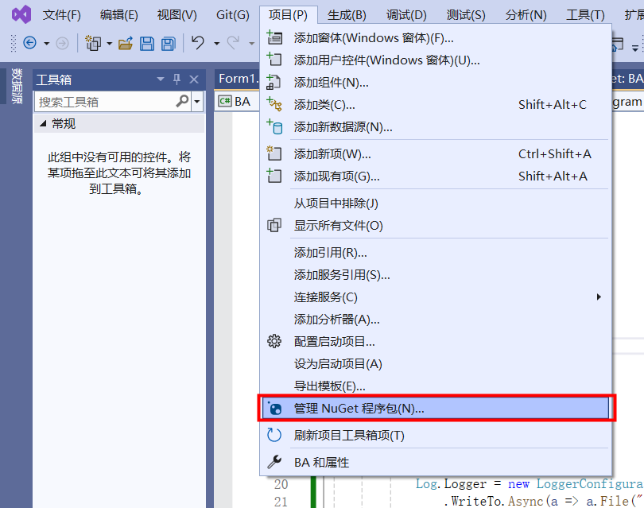
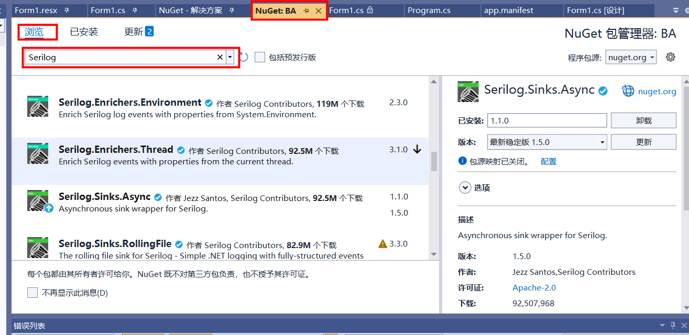

[C#日志记录：实现应用程序的监控与调试-CSDN博客](https://blog.csdn.net/qq_35320456/article/details/136497822)

## 1.NuGet程序包下载

**点击项目：**



****

**搜索Serilog并下载对应的支持包**



> 注意NuGet包的版本支持和.NET框架版本相关
>
> 有些较新版本的NuGet包不支持老的框架

## 2.代码撰写方式

**Serilog包的初始化应在program.cs中完成，执行在main函数中，示例代码如下：**

包含：

1、异步日志，提高效率

2、指定日志输出格式

3、指定日志异步输出到文件

4、指定日志文件滚动周期、指定日志文件数量、指定日志文件大小

5、运行主程序之后关闭日志

6、程序异常捕获日志落盘

```c#
using System;
using System.Collections.Generic;
using System.Linq;
using System.Windows.Forms;
using Serilog;
using Serilog.Events;
using Serilog.Formatting.Compact;
using Serilog.Sinks.File;

namespace BA
{
    static class Program
    {
        /// <summary>
        /// 应用程序的主入口点。
        /// </summary>
        [STAThread]
        static void Main()
        {
            Log.Logger = new LoggerConfiguration()
                .WriteTo.Async(a => a.File("log.txt",
                    outputTemplate: "{Timestamp:yyyy-MM-dd HH:mm:ss} [{Level:u3}] {Message:lj}{NewLine}{Exception}",
                    rollingInterval: RollingInterval.Day,
                    retainedFileCountLimit: 7,
                    fileSizeLimitBytes: null))
                .CreateLogger();
            Application.SetUnhandledExceptionMode(UnhandledExceptionMode.CatchException);
            Application.ThreadException += new System.Threading.ThreadExceptionEventHandler(Application_ThreadException);
            AppDomain.CurrentDomain.UnhandledException += new UnhandledExceptionEventHandler(CurrentDomain_UnhandledException);

            Application.EnableVisualStyles();
            Application.SetCompatibleTextRenderingDefault(false);
            Application.Run(new Form1());
            Log.CloseAndFlush();//关闭日志记录器
        }
        // 应用程序未处理异常事件处理程序
        static void Application_ThreadException(object sender, System.Threading.ThreadExceptionEventArgs e)
        {
            Log.Error(e.Exception, "Application Thread Exception");
        }

        // 域未处理异常事件处理程序
        static void CurrentDomain_UnhandledException(object sender, UnhandledExceptionEventArgs e)
        {
            Log.Error((Exception)e.ExceptionObject, "Unhandled Exception");
        }
    }
}

```

**上面初始化完成后，后续就可以在Form1.cs中使用Log对象打印日志：**

```c#
Log.Error((Exception)e.ExceptionObject, "Unhandled Exception");
```

**打印日志可以分等级：**

```c#
Log.Information("这是一条Info级别的日志信息");
Log.Debug("这是一条Debug级别的日志信息");
Log.Warning("这是一条Warn级别的日志信息");
Log.Error("这是一条Error级别的日志信息");
Log.Fatal("这是一条Fatal级别的日志信息");
```

