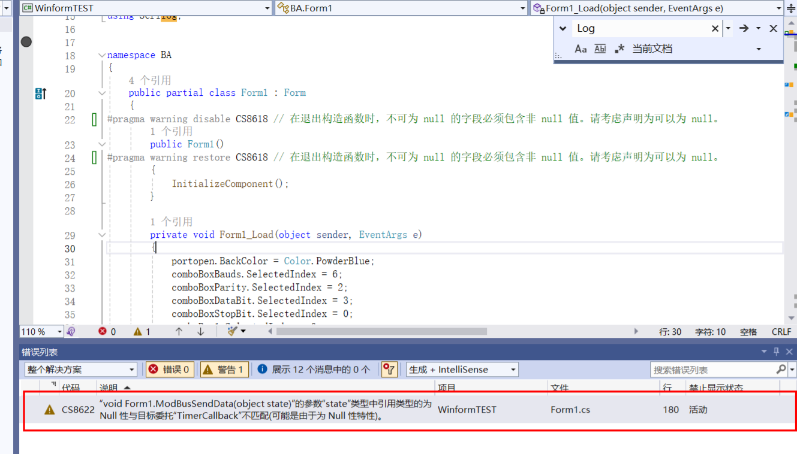

## 1、基本方法

### 输出打印：

​	C#要像C中的printf一样将内容打印到输出端，使用：

```c#
Console.WriteLine("供电模式345"+binStrLow40066);
```

## 2、进阶特性

### 忽略编译器警告：

编写代码余导这种警告时，我们可以根据警告代码来将警告忽略掉



具体方法如下：

```c#
//在警告发生代码前后使用结构忽略警告（由警告代码指定）
#pragma warning disable CS8618 
        public Form1()
#pragma warning restore CS8618
```

