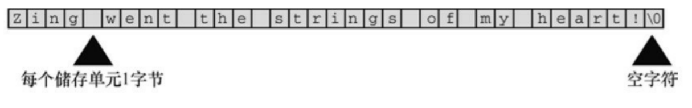

## 1. 背景

​	Linux系统的重要特点是以“一切皆是文本流，万物皆是文件“。 所以在Linux环境下使用C语言进行编程的时候，会涉及到大量的字符/字符串处理和格式化输入输出，这就需要Linux嵌入式软件工程师对C语言的字符串处理熟练掌握。

## 2. 字符串和格式化输入输出

​	但从常量数据类型来讲，有字符类型和字符串类型。

### 2.1 char类型数组和null字符

#### 空字符、字符串和字符数组

**空字符:**非打印字符，C语言中用来标记字符串的结束。ASCII码值为0。



> **注意！**
>
> 1. C语言字符串都存储在char类型数组中
> 2. char类型数组长度必须比待存储字符串的字符数多1，余下的用于存储null
> 3. char类型的大小为一个字节，也就是8位二进制
> 4. 定义char数组的时候，比如char name[5]，即**分配了一个5字节空间的buf**
> 5. 使用字符串必须创建字符数组
> 6. 除了对字符数组元素的精细操作之外，null字符有编译器自动在IO过程填入，我们只需要在字符数组的操作过程中注意给其预留空间即可

---


#### stdio中的字符串输入输出

**输入一个单词：scanf**

> 1. `scanf("%s", name);`
>    1. %s指定输入类型为字符串；name为赋值变量的地址
>    2. stdin中遇到第一个空白（空格、制表符和换行符）的时候便终止IO，也就是输入一个单词

**输入一个字符串：基于行的流IO，fgets()**

> 1. 遇到换行符的时候终止IO，并且不读入\n

**标准输出：printf()**

> 1. ```c
>    printf("circumference = %1.2f, area = %1.2f\n", circum,area);
>    ```
>
> 2. %1.2f表示格式化输出结果四舍五入并保留两位小数，数据类型为浮点型float

---

#### 字符串和字符数组的区别

**“x”和'x'的区别**

1. ‘x’为基本数据类型char；“x”为派生数据类型char数组
2. “x”有两个字符组成，'x'和'\0'

---

#### strlen()函数和sizeof()函数

>  **sizeof()：**返回对象的字节数（buf的总大小）
>
> 1. 计算整个字符数组的buf长度（bytes）


> **strlen()：**返回字符串的字符长度
>
> 1. 长度计算不包含null
> 2. 如果字符数组没被填满，其计算的是被填满的字符串长度
>
> 

### 2.2 常量和C预处理器

#### 符号常量和预处理

> ```c
> //下面是符号常量的定义
> #define NAME value
> ```
>
> 注意：
>
> 1. 符号常量名要大写，这是C语言的约定俗成的规定，方便阅读
> 2. 结尾不加分号
> 3. **常用来定义字符或字符串常量**
> 4. 替换过程由预处理器完成
> 5. 降低代码维护成本
>
> 扩展：变量命名的约定俗成规矩，在名称前带c_或k_前缀来表示常量（如c_level或k_line）。

---


#### const限定符

**说明：**

1. 用于限定一个变量为只读，代码中不可更改

---

**明示常量**

```c
//定义在头文件limits.h和float.h中的一些符号常量，可以根据计算机位来判断数据类型的值范围
#include <limits.h>
#include <float.h>
#define INT_MAX +32767
#define INT_MIN -32768

```

