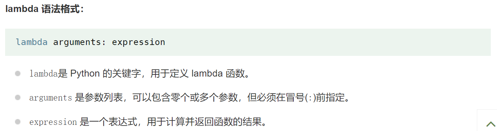

优秀博文：[Python lambda（匿名函数） | 菜鸟教程 (runoob.com)](https://www.runoob.com/python3/python-lambda.html)

## 函数结构

**本质上还是说定义一个函数，故不能在定义的时候传参**

## 注意：

- lambda不能内嵌if测试，它只能使用一些简单的方法（比如一些简单的数学运算）
- lambda通常与内置函数如map()、filter()和reduce()一起使用，以便在可迭代对象上执行操作

