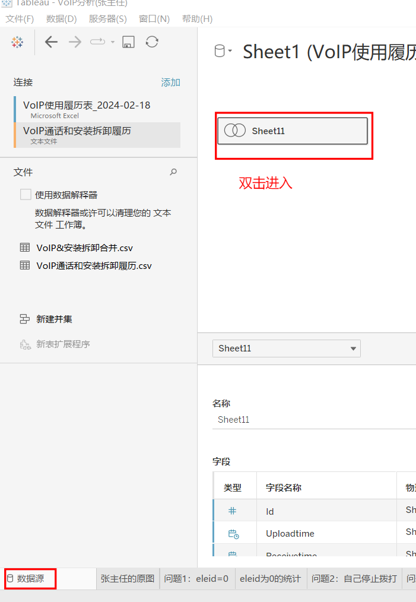
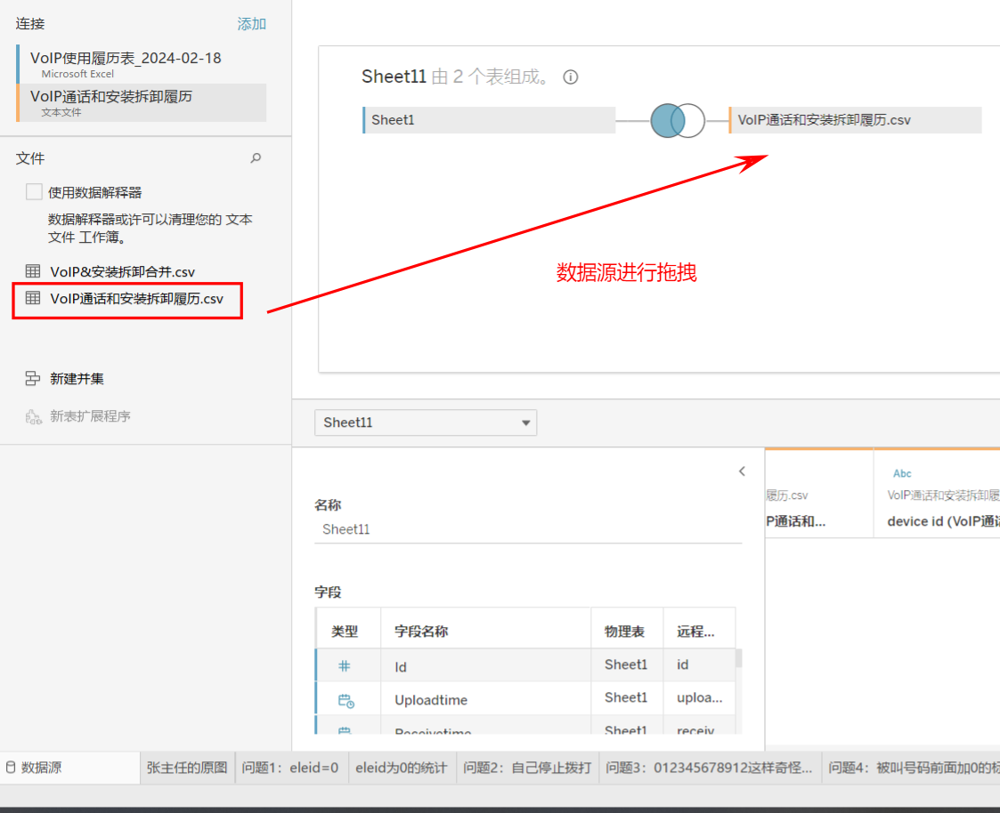
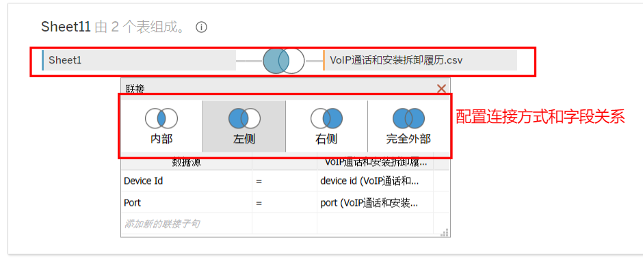
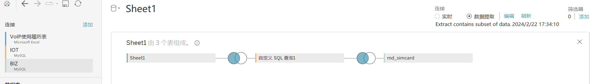
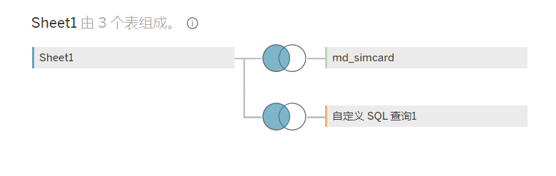
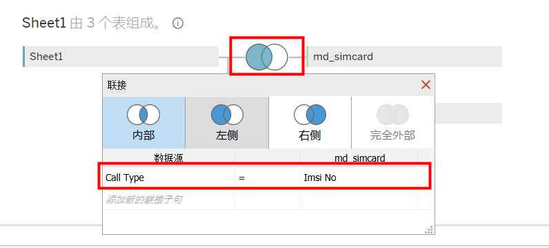
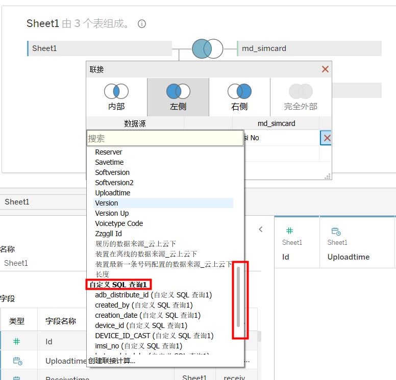
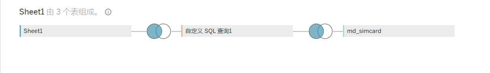
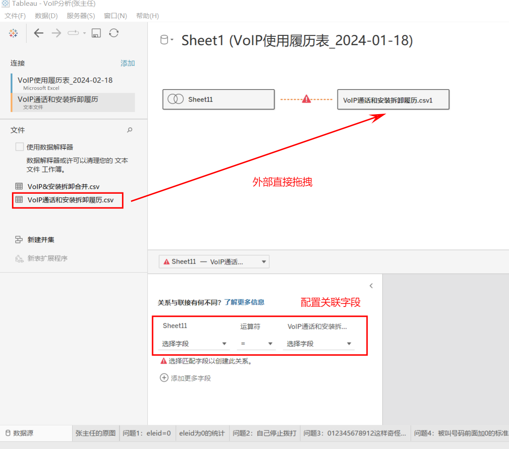

# 1. 数据源的连接

​	Tableau中支持两种数据连接的方式：

## 1.1 **第一种**：数据源联接（内连接、左连接、右连接、全连接）

### 1.1.1 联接的操作方式

类似于数据库连接

> 
>
> 
>
> 

### 1.1.2 拓展

#### 如何实现至少三个数据表的串联联接？

**第一步：**

- 首先通过拖拽实现两个数据表的联接
  - 本例实现的是sheet1和自定义SQL查询1的左连接

**第二步：**

- 将第三个数据表拖拽进去。
- Tableau初始默认和最前面的sheet1联接
- 编辑Sheet1和md_simcard的连接
- 下拉选择自定义SQL查询1的字段	
- 完成三个数据表的串联

## 1.2 **第二种**：数据源的类型关系

## 1.3 如何使用上述两种类型？

​	当可以明确数据表之间进行联接时，就使用联接。只有不明确的时候才使用关联；

​	关联有的时候会产生意想不到的问题，慎用；

​	关联是一种Tableau提供的根据工作表当前语义自动联接的方式，官方的解释见：[关系与联接有何不同 - Tableau](https://help.tableau.com/current/pro/desktop/zh-cn/datasource_relationships_learnmorepage.htm?source=productlink)