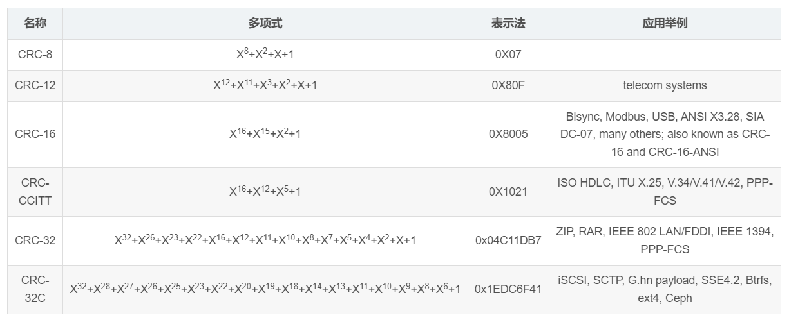

> 优秀博文：[【科普向】谁都能看懂的CRC（循环冗余校验）原理_crc循环冗余校验原理-CSDN博客](https://blog.csdn.net/weixin_44256803/article/details/105805628)

## 1、常识

**CRC是什么：**

1. 循环冗余校验

2. CRC对于输入数据的二进制位数没有限制

   

## 2、模二运算

### 2.1 基本特性

1. 适用于移位寄存器的运算（移位寄存器每一位独立，只有两种状态：0和1）
2. 与四则运算类似，包括模二加、模二减、模二乘、模二除
3. 模二运算不考虑进位和借位，每一位的运算独立

### 2.2 运算特性

1. 模二加和模二减的结果相同，相当于两个数按位异或
2. 奇数个1相加得1，偶数个1相加得0
3. 模二乘和模二除与四则乘除法一样演算
4. 模二乘时需要部分积相加时按模二加
5. 模二除时需要部分余数相减时按模二减

### 2.3 模二除的运算规则

> 模二除是CRC的基础

1. 当最后余数的位数小于除数位数时，除法停止
2. 当被除数的位数小于除数位数时，则商数为0，被除数就是余数
3. 只要被除数或部分余数的位数与除数一样多，且最高位为1，不管其他位是什么数，皆可商1（就是演算步骤中最上面可以写1）

## 3、CRC算法

### 3.1 基本思想

要传输的数据**模二除**算法约定除数，得到的余数作为CRC校验数据附加到原始数据后面再进行传输


### 3.2 通讯方式

1. 发送方和接收方在通信前，约定好一个预设整数作为除数
2. 发送方在发送前根据原始数据和约定好的除数进行**模二除**，得到CRC码，将其附加到原始数据后面一起发送
3. 接收方收到后将数据**模二除**约定好的除数，结果为0，则接收方人为数据正确

### 3.3 CRC码计算一般思路

1. 确定CRC算法
2. 确定除数多项式
3. 除数多项式的最高次为CRC码位数
4. 暂时将CRC码定为0
5. 原始数据+初始CRC码对CRC多项式二进制系数进行模二除
6. 得到余数为实际的CRC码
7. 待传输数据替换CRC码之后进行传输即可

## 4、代码实现（查表法）

### 4.1 C#代码实现CRC-16

```c#
public static class CRC16
{
    static readonly ushort[] crcTable = new ushort[256]
    {
        0x0000, 0x1021, 0x2042, 0x3063, 0x4084, 0x50a5, 0x60c6, 0x70e7,
        0x8108, 0x9129, 0xa14a, 0xb16b, 0xc18c, 0xd1ad, 0xe1ce, 0xf1ef,
        0x1231, 0x0210, 0x3273, 0x2252, 0x52b5, 0x4294, 0x72f7, 0x62d6,
        0x9339, 0x8318, 0xb37b, 0xa35a, 0xd3bd, 0xc39c, 0xf3ff, 0xe3de,
        0x2462, 0x3443, 0x0420, 0x1401, 0x64e6, 0x74c7, 0x44a4, 0x5485,
        0xa56a, 0xb54b, 0x8528, 0x9509, 0xe5ee, 0xf5cf, 0xc5ac, 0xd58d,
        0x3653, 0x2672, 0x1611, 0x0630, 0x76d7, 0x66f6, 0x5695, 0x46b4,
        0xb75b, 0xa77a, 0x9719, 0x8738, 0xf7df, 0xe7fe, 0xd79d, 0xc7bc,
        0x48c4, 0x58e5, 0x6886, 0x78a7, 0x0840, 0x1861, 0x2802, 0x3823,
        0xc9cc, 0xd9ed, 0xe98e, 0xf9af, 0x8948, 0x9969, 0xa90a, 0xb92b,
        0x5af5, 0x4ad4, 0x7ab7, 0x6a96, 0x1a71, 0x0a50, 0x3a33, 0x2a12,
        0xdbfd, 0xcbdc, 0xfbbf, 0xeb9e, 0x9b79, 0x8b58, 0xbb3b, 0xab1a,
        0x6ca6, 0x7c87, 0x4ce4, 0x5cc5, 0x2c22, 0x3c03, 0x0c60, 0x1c41,
        0xedae, 0xfd8f, 0xcdec, 0xddcd, 0xad2a, 0xbd0b, 0x8d68, 0x9d49,
        0x7e97, 0x6eb6, 0x5ed5, 0x4ef4, 0x3e13, 0x2e32, 0x1e51, 0x0e70,
        0xff9f, 0xefbe, 0xdfdd, 0xcffc, 0xbf1b, 0xaf3a, 0x9f59, 0x8f78,
        0x9188, 0x81a9, 0xb1ca, 0xa1eb, 0xd10c, 0xc12d, 0xf14e, 0xe16f,
        0x1080, 0x00a1, 0x30c2, 0x20e3, 0x5004, 0x4025, 0x7046, 0x6067,
        0x83b9, 0x9398, 0xa3fb, 0xb3da, 0xc33d, 0xd31c, 0xe37f, 0xf35e,
        0x02b1, 0x1290, 0x22f3, 0x32d2, 0x4235, 0x5214, 0x6277, 0x7256,
        0xb5ea, 0xa5cb, 0x95a8, 0x8589, 0xf56e, 0xe54f, 0xd52c, 0xc50d,
        0x34e2, 0x24c3, 0x14a0, 0x0481, 0x7466, 0x6447, 0x5424, 0x4405,
        0xa7db, 0xb7fa, 0x8799, 0x97b8, 0xe75f, 0xf77e, 0xc71d, 0xd73c,
        0x26d3, 0x36f2, 0x0691, 0x16b0, 0x6657, 0x7676, 0x4615, 0x5634,
        0xd94c, 0xc96d, 0xf90e, 0xe92f, 0x99c8, 0x89e9, 0xb98a, 0xa9ab,
        0x5844, 0x4865, 0x7806, 0x6827, 0x18c0, 0x08e1, 0x3882, 0x28a3,
        0xcb7d, 0xdb5c, 0xeb3f, 0xfb1e, 0x8bf9, 0x9bd8, 0xabbb, 0xbb9a,
        0x4a75, 0x5a54, 0x6a37, 0x7a16, 0x0af1, 0x1ad0, 0x2ab3, 0x3a92,
        0xfd2e, 0xed0f, 0xdd6c, 0xcd4d, 0xbdaa, 0xad8b, 0x9de8, 0x8dc9,
        0x7c26, 0x6c07, 0x5c64, 0x4c45, 0x3ca2, 0x2c83, 0x1ce0, 0x0cc1,
        0xef1f, 0xff3e, 0xcf5d, 0xdf7c, 0xaf9b, 0xbfba, 0x8fd9, 0x9ff8,
        0x6e17, 0x7e36, 0x4e55, 0x5e74, 0x2e93, 0x3eb2, 0x0ed1, 0x1ef0
    };

    public static ushort Calculate(byte[] data)
    {
        ushort crc = 0xFFFF;

        foreach (byte b in data)
        {
            byte index = (byte)((crc >> 8) ^ b);
            crc = (ushort)((crc << 8) ^ crcTable[index]);
        }

        return crc;
    }
}
```

