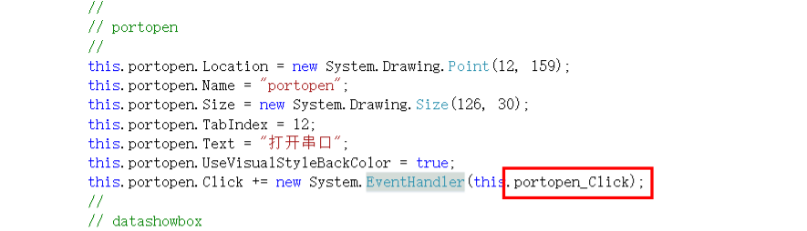

## 1. 前端代码框架

### 1.3 基本前端框架

- 对于每一个窗口控件，在前端界面代码中指定控件对应的触发方法
  - 如下，界面代码中保存有对应控件的属性和事件触发函数
  - 当然控件的基本属性是在designer中设置的，这样会方便很多
  - 

### 1.2 进程1：前端主进程

- 窗口初始化方法：
  - PC串口检查
  - 串口参数预填
  - 串口预打开
- 串口参数与串口打开
  - 串口参数使用下拉列表形式
  - 串口设置按钮触发设置串口参数、打开串口
- 串口发送
  - 发送固定的查询消息（BAS主机）
- 通过控件的对象名称可以在代码中动态调用和设置对应的控件特性

### 1.3 进程2：后端接收数据进程

接收串口数据：

- 检查串口是否打开
- 校验数据是否正常
- 做好异常处理
- 如果数据长度正常，调用对应的协议解析函数
  - 根据地标协议解析对应的数据

### 1.4 总结

- 主要是在基本的前端框架中，设置对应的属性
- 并在前端主代码中，使用串口库进行串口的一些操作
- 还是通过事件+回调的方式
- 本代码中回调中使用了一种方法，可以动态修改当前控件事件的操作
  - 将控件的一个属性（比如text）作为控件的状态
  - 根据控件的状态进行不同的操作
  - 操作中再进行状态的翻转
- 注意涉及到非代码本地的处理（通信交互），要把异常考虑全面
  - 针对每种异常都做对应的反馈处理
  - 预留一种万金油异常处理（通常用else或者try）

