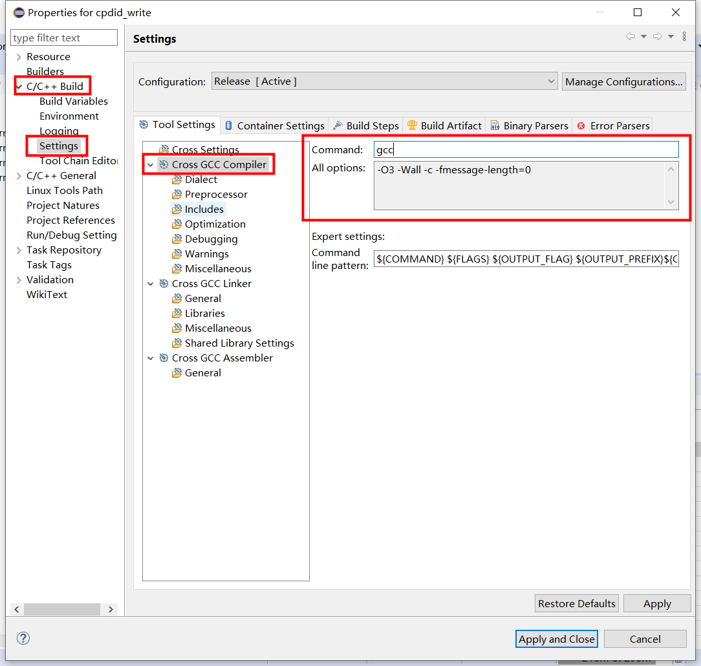

## 基本配置
1. 代码文件编码格式
在Window→Preferences→General→Workspace→Text file encoding选择other: UTF-8
2. 代码format
在Window→Preferences→C/C++→Code Style→Formatter→Import：选择 [diglink_formatter.xml](diglink_formatter.xml)
3. 编译前保存
在Window→Preferences→General→Workspace，展开后选择Build，勾选Save automatically before manual build。

## 使用小技巧
1. 代码自动展开
菜单Windows→Preferences→C/C++→Editor→Templates→New... 创建一条新的内容，如：
> Name: todo   
> Pattern: /* TODO: ${cursor} */

点击Apply保存。之后在编辑器中输入todo，然后按快捷键"Alt+/"，就会自动出现/* TODO:  */

除了上述新增的todo之外，还可以自行添加其他的常用代码，以及使用已有的代码片段。

推荐：

- 方便插入注释的template

> Name: 0   
> Pattern: /* ${comment} */

## 其他理解

1. ****交叉编译环境下，eclipse的工作区相当于Linux系统的根目录，相关的动态库编译目录都应该放在工作区中**
1. 这里便是和linux的shell中gcc命令一致，里面可以填入命令名和命令的选项；
1. 
