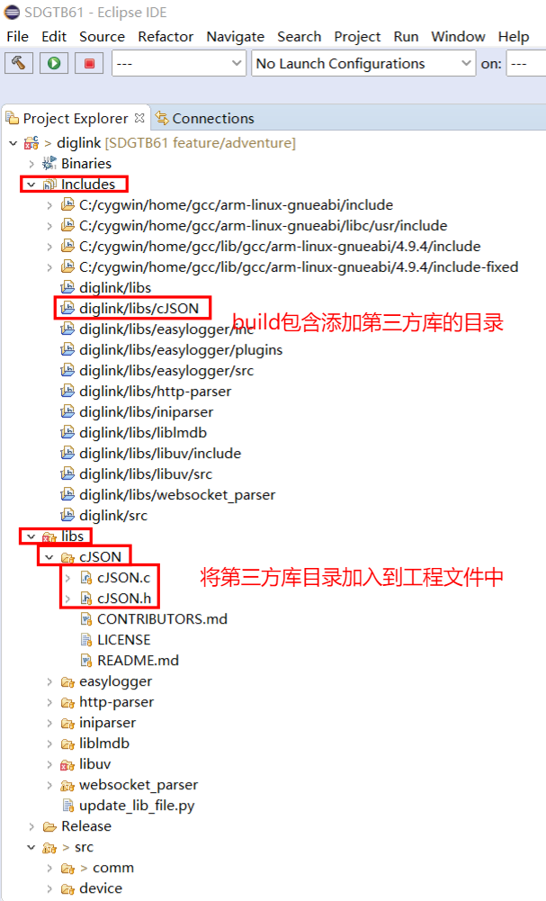
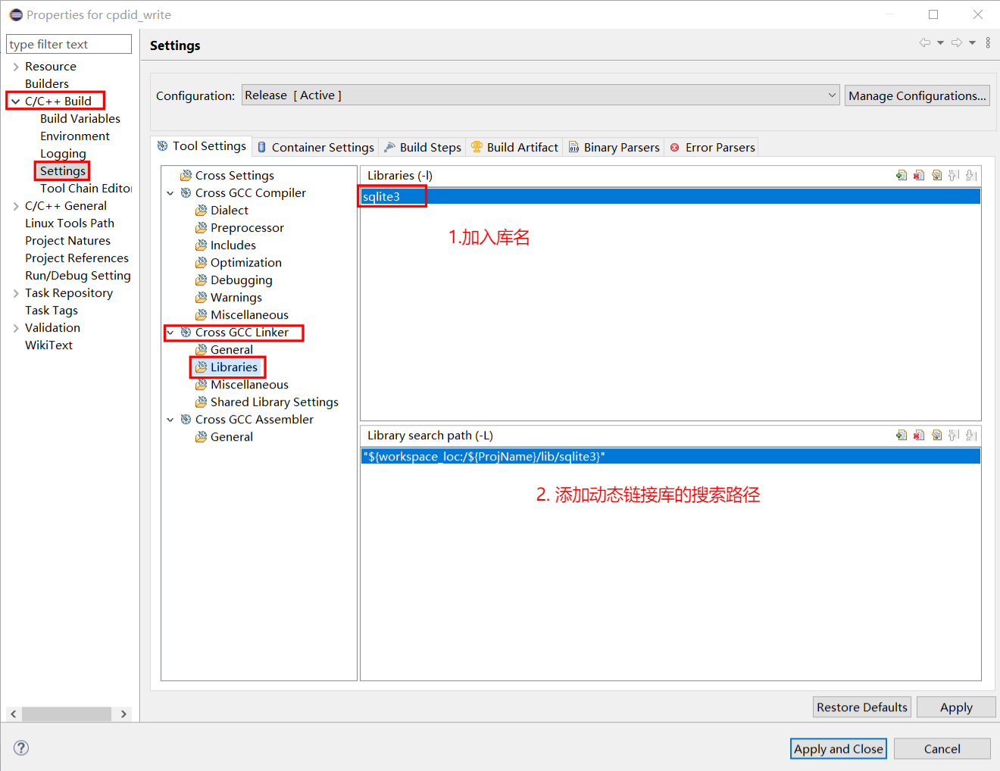
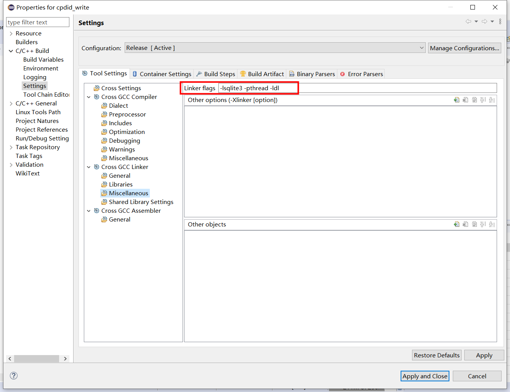

> 以移植第三方库**sqlite3**到**arm-linux目标板**为例（eclipse-win交叉编译环境下）

## 1. 说明

​	本例中使用sqlite3动态链接库作为例子。（项目没有选择Debug，只选择了Release）

#### 交叉编译环境下链接第三方库有三种方式：

- **在官网下载源码（.c和.h文件）**，直接加到工程中，使用的时候直接在自己的代码中引用源文件：
  - 典型的案例是cJSON
  - 
- **动态链接库**
  - 典型案例是sqlite3
- **静态链接库**
  - 典型案例是正则表达式库（本文不细说）

接下来以引用sqlite3动态链接库的方式介绍

## 2. 使用eclipse编译动态链接库

请参考前文**D:\my_documents\学习文件\笔记\4.IDE工具\4.1交叉编译\1. eclipse安装与使用\1.3 动态库交叉编译配置.md**

## 3. 添加动态链接库文件到工程目录

- eclipse交叉编译环境下，使用时，需要在应用代码工程目录下新建libs目录，并创建子目录sqlite3（例子），将libsqlite3.so文件添加到该子目录中：


- 此外，还需要将.h文件加入到源代码目录以引用


## 4. 业务代码中增加对.h文件的引用

```c
#include <stdio.h>
#include <stdlib.h>
#include "sqlite3.h"
int main(void) {
	sqlite3 *db;
	return 0;
}
```

## 5. eclipse相关配置

 我们的项目类型是executable。

#### 5.1 添加动态链接库的库名和搜索路径

上面是库的名字，即libsqlite3.so文件去掉前面的lib和文件后缀名.so

下面是工程目录中包含libsqlite3.so的目录路径



#### 5.2 添加动态链接库编译链接选项

加入**-lsqlite3 -pthread -ldl**



#### 5.3 执行build即可

