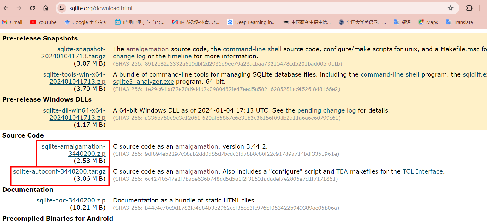
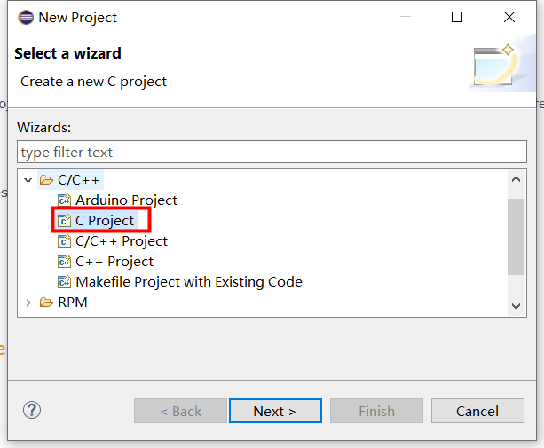
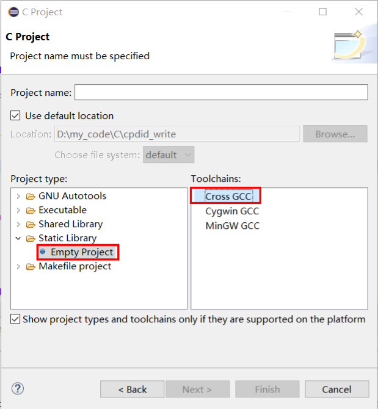
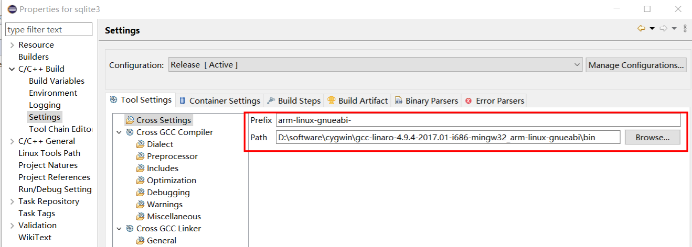
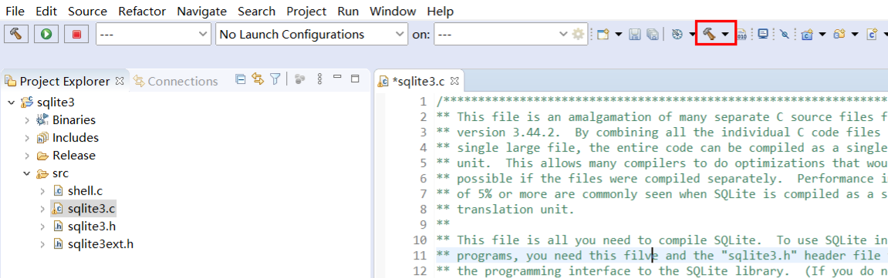
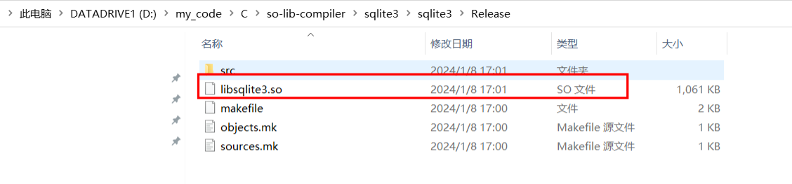
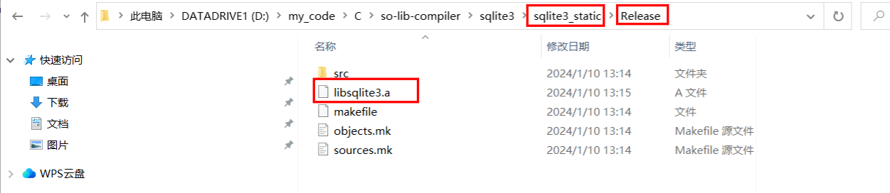
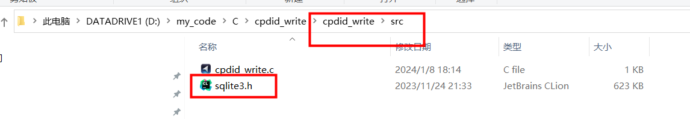

> **关于动态库和静态库相关的知识可以参考D:\my_documents\学习文件\笔记\7.linux学习\动态库与静态库.md**
>
> 本笔记以交叉编译sqlite3生成静态库为例子
>
> 

### 1. 首先在官网下载sqlite3库对应的源码

下载地址为：https://www.sqlite.org/download.html

注意官网有两个源码：

其中第一个源码为单纯的集成.c和.h文件

而第二个源码为包含cmake的configure文件的源码

本次交叉编译在windows环境下的eclipse中进行，第二个源码因包含很多cmake相关文件，属于Linux下编译使用

**故本次下载第一个源码文件**

### 2. eclipse中的操作

#### 2.1 在eclipse中建立新的交叉编译静态库项目

#### 2.2 配置交叉编译工具

>Prefix:arm-linux-gnueabi-
>
>Path:“添加win-PC中交叉编译工具的bin路径”

#### 2.3 与动态库的编译选项不同，静态库不需要指定为PIC（位置无关）

#### 2.4 点击build即可完成构建

#### 2.5 在工程的Realse目录下会生成我们需要的libsqlite3.a文件，即静态链接库文件

#### 2.6 静态链接库的使用注意：

- 静态链接库的编译**目录要独立出来**，不要使用和应用工程统一目录下，在eclipse中应该有**不同的workspace**
- eclipse交叉编译环境下，使用时，需要在应用代码工程目录下新建libs目录，并创建子目录sqlite3（例子），将libsqlite3.a文件添加到该子目录中：

- 此外，还需要将.h文件加入到源代码目录以引用

