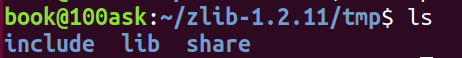
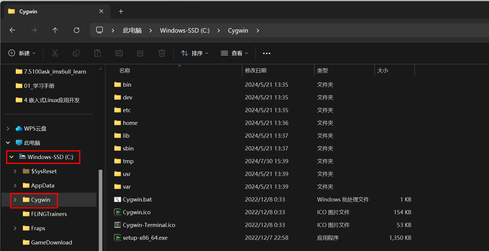
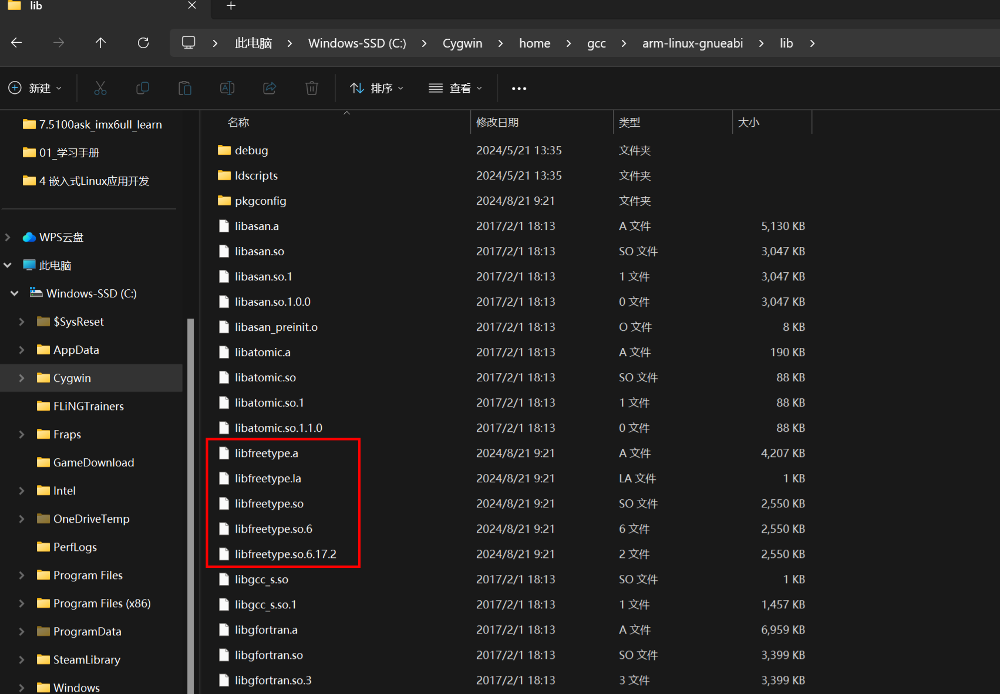
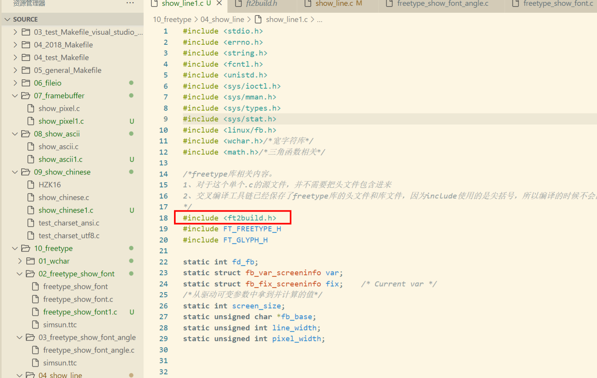
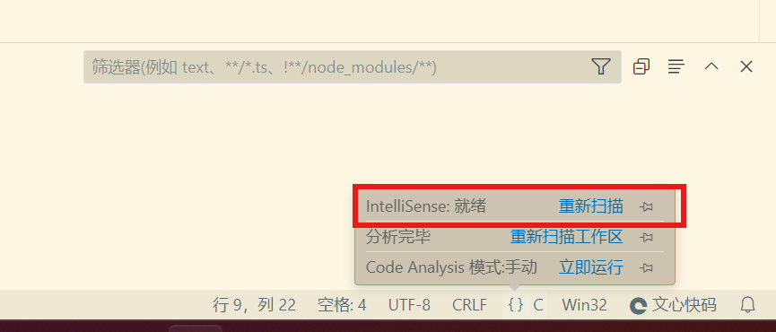

# 1、第三方库的编译

在unbuntu环境下，通过《嵌入式Linux/应用开发完全手册V5.2：6.4 交叉编译程序：以 freetype 为例  》所示的方法（或者使用buildroot工具），编译第三方库，在源码tmp路径下得到头文件目录和库文件目录：

我的Winows交叉环境主要是在Vscode上写代码，然后在unbuntu上编译，所以在C盘配置有如下路径：

在`C:\Cygwin\home\gcc\arm-linux-gnueabi\include`和`C:\Cygwin\home\gcc\arm-linux-gnueabi\lib`分別添加对应编译好的第三方库头文件和库文件

然后就可以在VScode中正常查看对应的第三方库辣！

（前提是你的Vscode使用的解释器为Cygwin->gcc的Windows交叉编译解释器，这需要配置IntelliSense）

