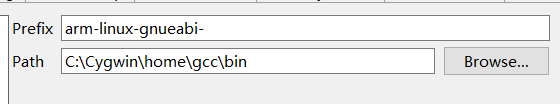
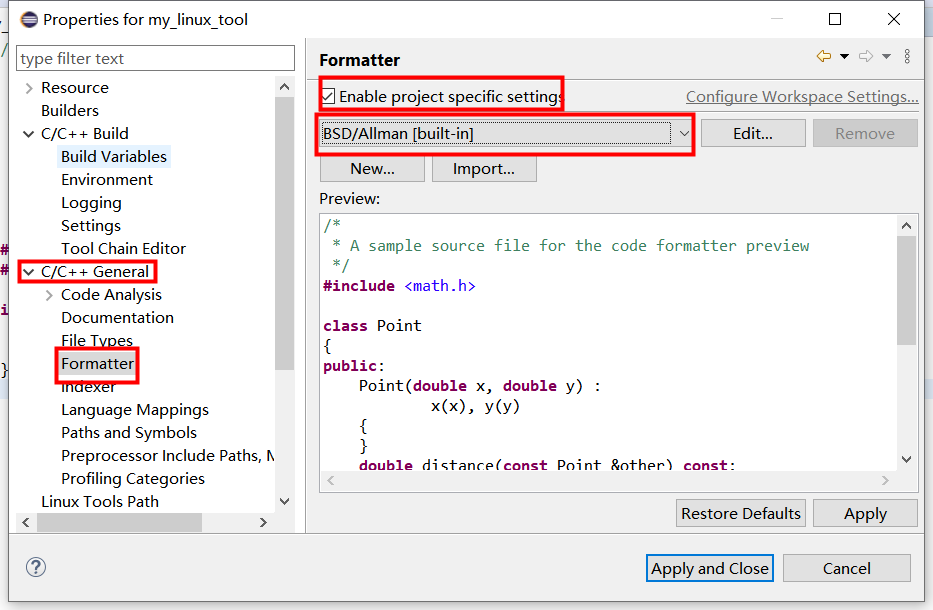
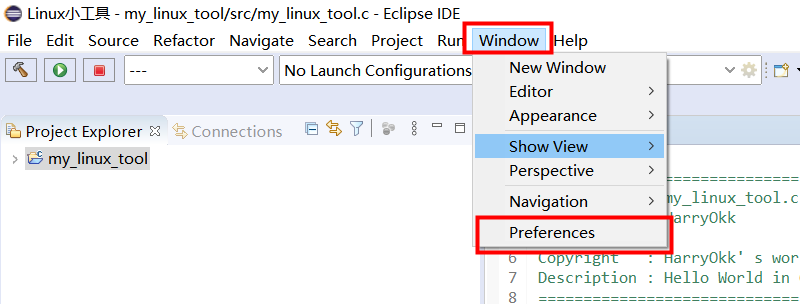
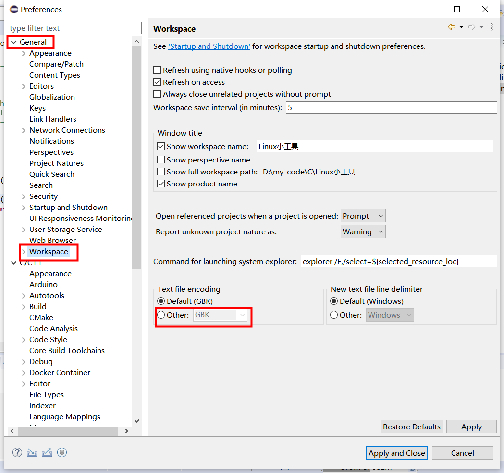
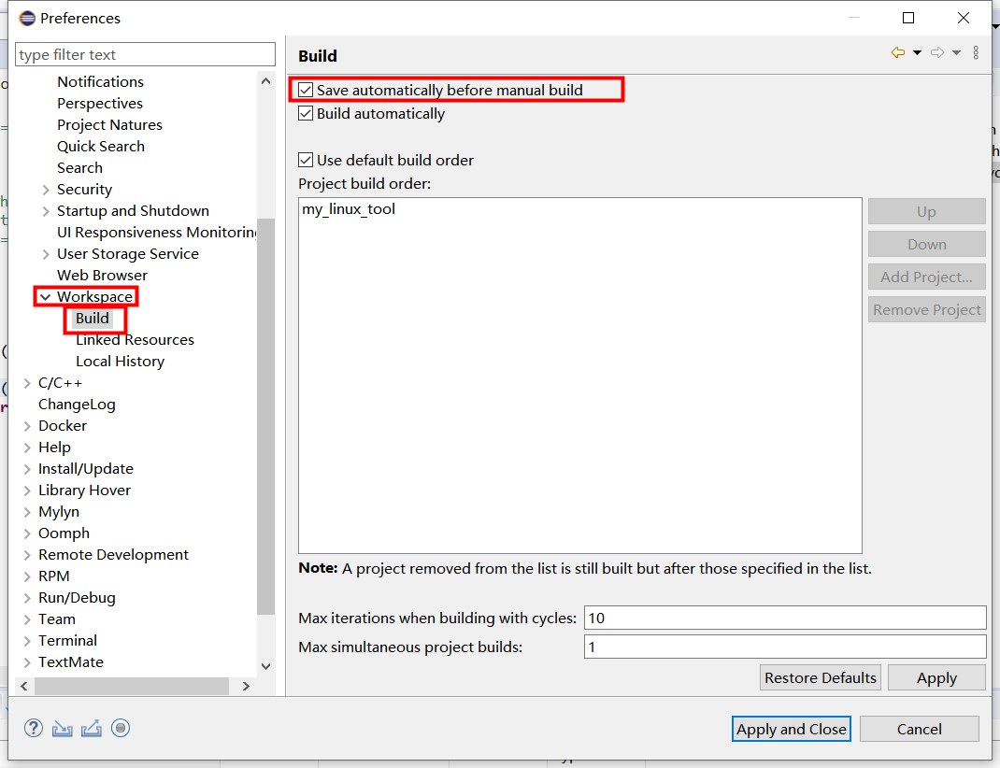

# 交叉编译环境配置

## 1. eclipse交叉编译环境配置学习

### 1.1 创建项目

**在 Eclipse 中创建一个新项目，选择项目类型为 Cross GCC。**

> Cross GCC项目表示本项目是指定使用**交叉编译器**的项目，这样后续就可以配置交叉编译的工具链；
>
> 后续还需要配置争取的工具链进行编译、链接和调试

---

> **链接：**
>
> 编译的最后一个阶段，将已编译的目标文件和库文件组合在一起，生成可执行文件。
>
> 因为需要组合目标文件和库文件，所以链接器需要指导交叉编译器的路径，以便找到和目标系统兼容的库文件。

#### **1. 创建项目**

---

#### 2. 选择创建C项目

---

#### 3.选择项目类型：

我们需要生成一个可执行文件，就选择Executable，由于进行交叉编译，同时工具链选择Cross GCC

> **eclipse项目类型选择:**
>
> 
>
> 1. GUN Autotools：
>    1. 用途：**跨平台支持项目**。makefile可以保证在不同的标准化Unix和Linux系统之间都可以编译项目并执行。自动化构建工具，有点类似CMake tools，跨平台地执行构建
>    2. 生成文件：configure脚本，运行该脚本可以生成Makefile，通过生成的Makefile可以执行定制化的编译操作
> 2. Executable：
>    1. 用途：独立的应用程序
>    2. 生成文件：一个可执行文件，在目标系统上运行
> 3. Shared Library：
>    1. 用途：生成共享库（动态链接库）
>    2. 生成文件：共享库文件（.so文件）
> 4. Staric Library：
>    1. 用途：生成静态库的项目类型
>    2. 生成文件：静态库文件（.a文件）

---

> **Cross GCC、Cygwin GCC、MinGW GCC三个GCC编译工具链的区别：**
>
> 1. **Cross GCC**：跨平台工具链，比如在Windows系统生成Linux系统上的可执行文件
> 2. **Cygwin GCC**：该工具链提供类Unix的环境，使得在Windows开发和在类Unix开发的体验没差。提供包括POSIX API等库的实现
> 3. **MinGW GCC**：Minimalist GNU for Windows，用于生成Windows的本机程序，生成的可执行文件依赖于Windows API而不是类Unix。

#### 4. 填写作者的基本信息

#### 5. 选择调试和编译选项

#### 6. 配置交叉编译器的前缀和路径

GCC设置：注意前缀为“arm-linux-gnueabi-”，同时给出gcc-linaro-4.9.4-2017.01-i686-mingw32_arm-linux-gnueabi的bin路径：

也可以后续进行修改：

#### 7. 交叉编译工具的环境配置

**将Cygwin的压缩包解压到C盘根目录下：**、

#### 8. Formatter统一选择BSD/Allman

#### 9. 对编写完成的程序执行：Format(快捷键：ctrl+shift+f)

#### 10. 其它设置注意（如果有多个Configuration，最好全选，避免另一个配置（如Debug）编译时出错）：

- 为了避免出现异常，workspace的路径不要包含中文字符和空格。

- 优化选择None

- C语言标准通常选择C99，但对SDGTA01-A，如果采用-std=C99，会编译出错，修改为`-std=gnu99`，同时Language Standard不要选择：

- 同时增加其它与编译有关的选项设置（包括arm类型）：-march=armv7 -lpthread

- Linker也需要增加：-lpthread

- 开通并行编译来加快速度

- 需要在编译完成后执行其它工作时的设置，如DigTel-II程序的打包：

  > rm -rf usr; mkdir -p usr/sbin/; cp -rf ${ProjName} usr/sbin/; tar zcvf ${ProjName}.tar.gz usr/; rm -rf usr;

- 编码统一使用UTF-8：如果之前未使用UTF-8编码，则需转换编码后使用:

   - 为了在编译时自动保存文件减少遗漏，可以进行如下设置:

