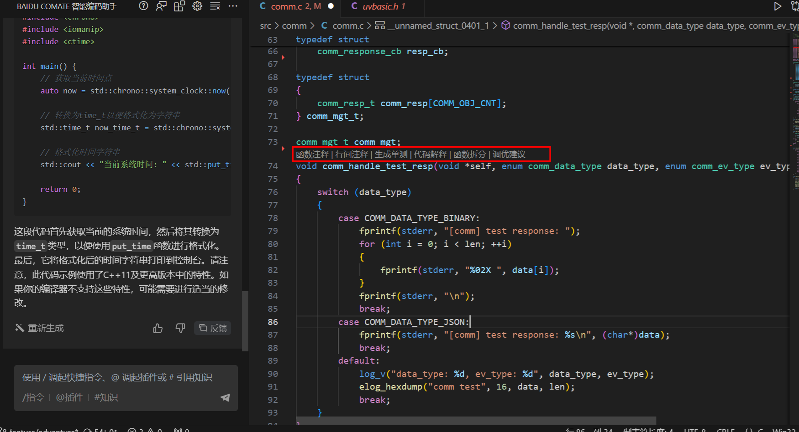

> 参考博文：
>
> [Baidu Comate最详细教程！（包含安装、详细的使用方法）_baidu comate 使用-CSDN博客](https://blog.csdn.net/green_U_pillow/article/details/138162554)

## 1. 基本功能使用

### 1.1 代码补全

​	编写代码的时候，Comate会根据工程文件自动联想，如果想采用Comate的联想，使用tab键即可

###  1.2 注释生成代码

你想要写的内容，写下注释，然后回车，Comate会生成一行代码，按下tab键，便可以采取Comate的建议，然后继续回车+tab

### 1.3 对话生成代码

### 1.4 代码解释

**哪里不会点哪里!**

