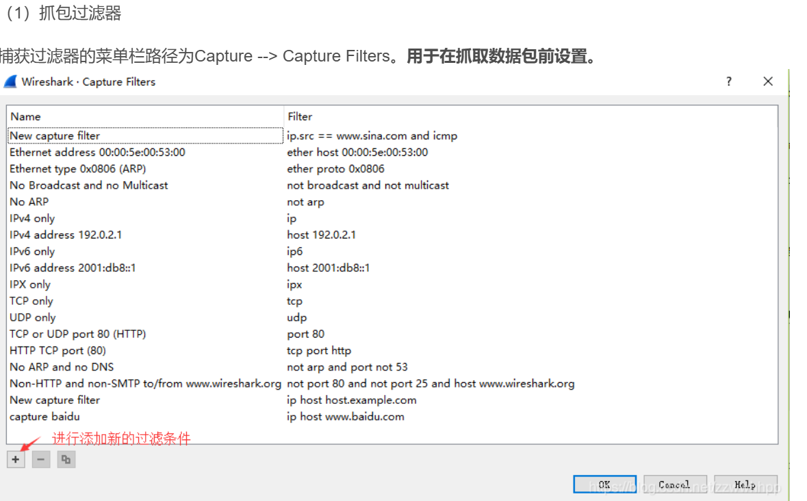
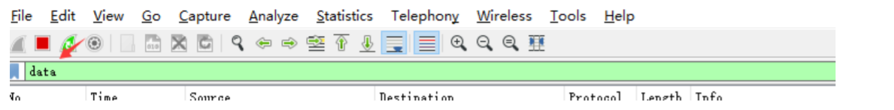

## 1、tcpdump抓包

进入对应linux设备，使用以下命令捕获一段时间内的网络包

```sh
# 捕获所有网络接口，输出到文件capture.pcap
tcpdump -i any -w capture.pcap
# 捕获特定网卡
tcpdump -i eth0 -w capture.pcap
# 捕获特定网卡的特定端口（以HTTP为例）
tcpdump -i eth0 port 80 -w capture.pcap
# 限制捕获数据包数量
tcpdump -i eth0 -c 100 -w capture.pcap
```

> [Linux使用tcpdump命令抓包并使用wireshark分析常见的场景和解读_tcpdump抓包查看内容-CSDN博客](https://blog.csdn.net/ethnicitybeta/article/details/140317736)


## 2、wireshark网络分析

将第1章捕获的网络包下载到windows中，通过wireshark进行分析，下面讲述wireshark的基本使用

### 2.1 wireshark主界面

进入wireshark后，可以选择当前主机的某一个连接进行捕获，当然我们是从linux中导出的pcap文件，就可以直接将文件拖入wireshark中进行分析


### 2.2 wireshark的两个过滤器

#### 2.2.1 抓包过滤器

当前Windows主机捕获数据包前的过滤规则



##### 语法：

抓包过滤器类型Type（host、net、port）、

方向Dir（src、dst）、

协议Proto（ether、ip、tcp、udp、http、icmp、ftp等）、

逻辑运算符（&& 与、|| 或、！非）

###### （1）协议过滤

比较简单，直接在抓包过滤框中直接输入协议名即可。

TCP，只显示TCP协议的数据包列表

HTTP，只查看HTTP协议的数据包列表

ICMP，只显示ICMP协议的数据包列表

###### （2）IP过滤

host 192.168.1.104

src host 192.168.1.104

dst host 192.168.1.104

###### （3）端口过滤

port 80

src port 80

dst port 80

###### （4）逻辑运算符&& 与、|| 或、！非

`src host 192.168.1.104 && dst port 80` 抓取主机地址为192.168.1.80、目的端口为80的数据包

`host 192.168.1.104 || host 192.168.1.102` 抓取主机为192.168.1.104或者192.168.1.102的数据包

`！broadcast` 不抓取广播数据包

#### 2.2.2 显示过滤器

显示过滤器用于捕获后的网络包，在我们这次Linux抓包的场景中，使用这个更方便


##### 语法：

###### （1）比较操作符

比较操作符有：

`==` 等于、`!=` 不等于、`>` 大于、`<` 小于、`>=` 大于等于、`<=`小于等于。

###### （2）协议过滤

比较简单，直接在Filter框中直接输入协议名即可。注意：协议名称需要输入小写。

`tcp`，只显示TCP协议的数据包列表

`http`，只查看HTTP协议的数据包列表

`icmp`，只显示ICMP协议的数据包列表

###### （3） ip过滤
`ip.src ==192.168.1.104` 显示源地址为192.168.1.104的数据包列表

`ip.dst==192.168.1.104`, 显示目标地址为192.168.1.104的数据包列表

`ip.addr == 192.168.1.104` 显示源IP地址或目标IP地址为192.168.1.104的数据包列表

###### （4）端口过滤

`tcp.port ==80`, 显示源主机或者目的主机端口为80的数据包列表。

`tcp.srcport == 80`, 只显示TCP协议的源主机端口为80的数据包列表。

`tcp.dstport == 80`，只显示TCP协议的目的主机端口为80的数据包列表。

###### 5） Http模式过滤

`http.request.method==“GET”`, 只显示HTTP GET方法的。

###### （6）逻辑运算符为 and/or/not

过滤多个条件组合时，使用`and/or`。比如获取IP地址为192.168.1.104的ICMP数据包表达式为`ip.addr == 192.168.1.104 and icmp`
###### 7）按照数据包内容过滤。假设我要以IMCP层中的内容进行过滤，可以单击选中界面中的码流，在下方进行选中数据。如下


右键单击选中后出现如下界面（作为过滤器应用）


选中Select后在过滤器中显示如下



后面条件表达式就需要自己填写。如下我想过滤出data数据包中包含"abcd"内容的数据流。**包含的关键词是contains 后面跟上内容**


### 2.2.3 例子：TCP抓包

以HTTP协议为例，HTTP协议底层使用tcp来建立连接，我们一般关注flags中的5个字段


其中，对于我们日常的分析有用的就是前面的五个字段。它们的含义是：

`SYN`表示建立连接，

`FIN`表示关闭连接，

`ACK`表示响应（接收到的字节数据长度），

`PSH`表示有DATA数据传输，

`RST`表示连接重置。