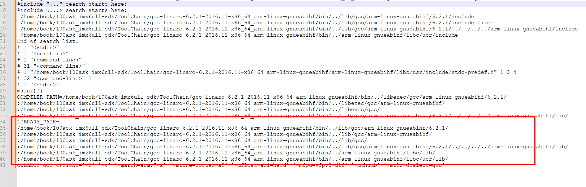

## 1、字符编码基础

**字符集：**

​	定义了显示字符与码元的对应规则。常用的字符集有ASCII、Unicode

**编码规则：**

​	字符集在计算机中的二进制存储方式。

**字符集与编码规则的对应关系：**

| 字符集  | 编码规则                                                     | 备注                                                         |
| ------- | ------------------------------------------------------------ | ------------------------------------------------------------ |
| ASCII   | ASCII                                                        |                                                              |
| Unicode | UTF-8、UTF-16 LE、UTF-16 BE、UTF32                           | 兼容GB2312等多种字符集                                       |
| GB2312  | GB2312                                                       |                                                              |
| ANSI    | windows默认使用的字符编码方案（包含多种字符集和对应的编码规则） | 比如.c中字符串如果有中文，默认指定字符集和编码规则为GB2313/GBK |

## 2、矢量字体的显示

​	在LCD中（包括现在主流的计算机屏幕显示字符），使用矢量字体方式显示文字可以让字体的放大缩小不失真。

**矢量字体**：

​	以关键点描述字体，主要过程为：

1、确认关键点

2、使用数学曲线秒点（贝塞尔曲线）

3、填充

**矢量字体文件：**

​	在windows中，默认存储在/c/Windows/Fonts中，字体文件保存了各种**字符集**的字体的**显示关键点**信息。

​	一个矢量字体文件中可能包含多种字符集，文件中使用“charmaps”来表征各种字符集，我们可以使用字符集中某个字符的码元来计算便宜地址，进而找到对应字符的glyph（关键点信息）

​	矢量字体文件的结构如下：


**矢量文字符的显示过程：**

1、给定一个字符并确定它的编码值

2、确定字体大小

3、根据编码值，从字体文件中找到charmaps对应的关键点（glyph）

4、把关键点信息转换为位图点阵

5、将点阵信息显示出来（LCD）

**freetype库的使用：**

​	

## 3、在源代码中直接获得某一字符的Unicode值

​	我们编辑的.c文件源代码中，字符串的实际二进制存储值受.c文件的编码方式影响。

​	而在使用矢量字符文件时，我们要获得关键点（glyph）就必须拿到字符对应的码元值（如果使用Unicode编码来索引关键点的话，最好使用Unicode字符集，因为其支持和适用性比较好，在矢量字符文件中也不需要索引对应的chamaps），**问题就来了，我们可以不可以不受.c文件的编码规则影响，而直接拿到字符的Unicode码元值？**

### 3.1 C语言的wchat_t宽字符支持

​	C语言中，定义字符串字面量为宽字符，则字符串对应的二进制值即为Unicode码元值，不受.c文件编码规则影响。

```c
#include <wchar.h>

wchar_t *chinese_str = L"中国就是最牛的。";
```

​	上面字符串字面量中：

1、每个字符都是wchar_t类型（默认占四个字节）

2、每个字符存储的二进制值均为Unicode码元值

### 3.2 gcc处理宽字符时注意

​	如果gcc编译的源文件使用GB2312编码（或者是ANSI），则应在编译时指定.c的编码规则为GN2312，以让gcc能够正常处理宽字符

```sh
gcc -finput-charset=GB2312 -o test wchar test wchar.c
```


## 4、GCC编译与字符编码

### 4.1 注意

gcc默认输入文件和输出文件均使用UTF-8编码，如果实际.c文件使用

​	

## 5、freetype库交叉编译

> 这在编译引用第三方库的时候真的很有用

### 5.1 交叉编译工具头文件和库文件路径的确认

#### 查询交叉编译工具的综合信息

```sh
echo 'main(){}'| arm-buildroot-linux-gnueabihf-gcc -E -v -
```

得到输出为：

```
Using built-in specs.
COLLECT_GCC=arm-linux-gnueabihf-gcc
Target: arm-linux-gnueabihf
Configured with: /home/tcwg-buildslave/workspace/tcwg-make-release/label/docker-trusty-amd64-tcwg-build/target/arm-linux-gnueabihf/snapshots/gcc-linaro-6.2-2016.11/configure SHELL=/bin/bash --with-mpc=/home/tcwg-buildslave/workspace/tcwg-make-release/label/docker-trusty-amd64-tcwg-build/target/arm-linux-gnueabihf/_build/builds/destdir/x86_64-unknown-linux-gnu --with-mpfr=/home/tcwg-buildslave/workspace/tcwg-make-release/label/docker-trusty-amd64-tcwg-build/target/arm-linux-gnueabihf/_build/builds/destdir/x86_64-unknown-linux-gnu --with-gmp=/home/tcwg-buildslave/workspace/tcwg-make-release/label/docker-trusty-amd64-tcwg-build/target/arm-linux-gnueabihf/_build/builds/destdir/x86_64-unknown-linux-gnu --with-gnu-as --with-gnu-ld --disable-libstdcxx-pch --disable-libmudflap --with-cloog=no --with-ppl=no --with-isl=no --disable-nls --enable-c99 --enable-gnu-indirect-function --disable-multilib --with-tune=cortex-a9 --with-arch=armv7-a --with-fpu=vfpv3-d16 --with-float=hard --with-mode=thumb --enable-multiarch --with-build-sysroot=/home/tcwg-buildslave/workspace/tcwg-make-release/label/docker-trusty-amd64-tcwg-build/target/arm-linux-gnueabihf/_build/sysroots/arm-linux-gnueabihf --enable-lto --enable-linker-build-id --enable-long-long --enable-shared --with-sysroot=/home/tcwg-buildslave/workspace/tcwg-make-release/label/docker-trusty-amd64-tcwg-build/target/arm-linux-gnueabihf/_build/builds/destdir/x86_64-unknown-linux-gnu/arm-linux-gnueabihf/libc --enable-languages=c,c++,fortran,lto --enable-checking=release --disable-bootstrap --build=x86_64-unknown-linux-gnu --host=x86_64-unknown-linux-gnu --target=arm-linux-gnueabihf --prefix=/home/tcwg-buildslave/workspace/tcwg-make-release/label/docker-trusty-amd64-tcwg-build/target/arm-linux-gnueabihf/_build/builds/destdir/x86_64-unknown-linux-gnu
Thread model: posix
gcc version 6.2.1 20161016 (Linaro GCC 6.2-2016.11) 
COLLECT_GCC_OPTIONS='-E' '-v' '-march=armv7-a' '-mtune=cortex-a9' '-mfloat-abi=hard' '-mfpu=vfpv3-d16' '-mthumb' '-mtls-dialect=gnu'
 /home/book/100ask_imx6ull-sdk/ToolChain/gcc-linaro-6.2.1-2016.11-x86_64_arm-linux-gnueabihf/bin/../libexec/gcc/arm-linux-gnueabihf/6.2.1/cc1 -E -quiet -v -imultilib . -imultiarch arm-linux-gnueabihf -iprefix /home/book/100ask_imx6ull-sdk/ToolChain/gcc-linaro-6.2.1-2016.11-x86_64_arm-linux-gnueabihf/bin/../lib/gcc/arm-linux-gnueabihf/6.2.1/ -isysroot /home/book/100ask_imx6ull-sdk/ToolChain/gcc-linaro-6.2.1-2016.11-x86_64_arm-linux-gnueabihf/bin/../arm-linux-gnueabihf/libc - -march=armv7-a -mtune=cortex-a9 -mfloat-abi=hard -mfpu=vfpv3-d16 -mthumb -mtls-dialect=gnu
ignoring duplicate directory "/home/book/100ask_imx6ull-sdk/ToolChain/gcc-linaro-6.2.1-2016.11-x86_64_arm-linux-gnueabihf/bin/../lib/gcc/../../lib/gcc/arm-linux-gnueabihf/6.2.1/include"
ignoring nonexistent directory "/home/book/100ask_imx6ull-sdk/ToolChain/gcc-linaro-6.2.1-2016.11-x86_64_arm-linux-gnueabihf/bin/../arm-linux-gnueabihf/libc/usr/local/include/arm-linux-gnueabihf"
ignoring nonexistent directory "/home/book/100ask_imx6ull-sdk/ToolChain/gcc-linaro-6.2.1-2016.11-x86_64_arm-linux-gnueabihf/bin/../arm-linux-gnueabihf/libc/usr/local/include"
ignoring duplicate directory "/home/book/100ask_imx6ull-sdk/ToolChain/gcc-linaro-6.2.1-2016.11-x86_64_arm-linux-gnueabihf/bin/../lib/gcc/../../lib/gcc/arm-linux-gnueabihf/6.2.1/include-fixed"
ignoring duplicate directory "/home/book/100ask_imx6ull-sdk/ToolChain/gcc-linaro-6.2.1-2016.11-x86_64_arm-linux-gnueabihf/bin/../lib/gcc/../../lib/gcc/arm-linux-gnueabihf/6.2.1/../../../../arm-linux-gnueabihf/include"
ignoring nonexistent directory "/home/book/100ask_imx6ull-sdk/ToolChain/gcc-linaro-6.2.1-2016.11-x86_64_arm-linux-gnueabihf/bin/../arm-linux-gnueabihf/libc/usr/include/arm-linux-gnueabihf"
#include "..." search starts here:
#include <...> search starts here:
 /home/book/100ask_imx6ull-sdk/ToolChain/gcc-linaro-6.2.1-2016.11-x86_64_arm-linux-gnueabihf/bin/../lib/gcc/arm-linux-gnueabihf/6.2.1/include
 /home/book/100ask_imx6ull-sdk/ToolChain/gcc-linaro-6.2.1-2016.11-x86_64_arm-linux-gnueabihf/bin/../lib/gcc/arm-linux-gnueabihf/6.2.1/include-fixed
 /home/book/100ask_imx6ull-sdk/ToolChain/gcc-linaro-6.2.1-2016.11-x86_64_arm-linux-gnueabihf/bin/../lib/gcc/arm-linux-gnueabihf/6.2.1/../../../../arm-linux-gnueabihf/include
 /home/book/100ask_imx6ull-sdk/ToolChain/gcc-linaro-6.2.1-2016.11-x86_64_arm-linux-gnueabihf/bin/../arm-linux-gnueabihf/libc/usr/include
End of search list.
# 1 "<stdin>"
# 1 "<built-in>"
# 1 "<command-line>"
# 31 "<command-line>"
# 1 "/home/book/100ask_imx6ull-sdk/ToolChain/gcc-linaro-6.2.1-2016.11-x86_64_arm-linux-gnueabihf/arm-linux-gnueabihf/libc/usr/include/stdc-predef.h" 1 3 4
# 32 "<command-line>" 2
# 1 "<stdin>"
main(){}
COMPILER_PATH=/home/book/100ask_imx6ull-sdk/ToolChain/gcc-linaro-6.2.1-2016.11-x86_64_arm-linux-gnueabihf/bin/../libexec/gcc/arm-linux-gnueabihf/6.2.1/:/home/book/100ask_imx6ull-sdk/ToolChain/gcc-linaro-6.2.1-2016.11-x86_64_arm-linux-gnueabihf/bin/../libexec/gcc/arm-linux-gnueabihf/:/home/book/100ask_imx6ull-sdk/ToolChain/gcc-linaro-6.2.1-2016.11-x86_64_arm-linux-gnueabihf/bin/../libexec/gcc/:/home/book/100ask_imx6ull-sdk/ToolChain/gcc-linaro-6.2.1-2016.11-x86_64_arm-linux-gnueabihf/bin/../lib/gcc/arm-linux-gnueabihf/6.2.1/../../../../arm-linux-gnueabihf/bin/
LIBRARY_PATH=/home/book/100ask_imx6ull-sdk/ToolChain/gcc-linaro-6.2.1-2016.11-x86_64_arm-linux-gnueabihf/bin/../lib/gcc/arm-linux-gnueabihf/6.2.1/:/home/book/100ask_imx6ull-sdk/ToolChain/gcc-linaro-6.2.1-2016.11-x86_64_arm-linux-gnueabihf/bin/../lib/gcc/arm-linux-gnueabihf/:/home/book/100ask_imx6ull-sdk/ToolChain/gcc-linaro-6.2.1-2016.11-x86_64_arm-linux-gnueabihf/bin/../lib/gcc/:/home/book/100ask_imx6ull-sdk/ToolChain/gcc-linaro-6.2.1-2016.11-x86_64_arm-linux-gnueabihf/bin/../lib/gcc/arm-linux-gnueabihf/6.2.1/../../../../arm-linux-gnueabihf/lib/:/home/book/100ask_imx6ull-sdk/ToolChain/gcc-linaro-6.2.1-2016.11-x86_64_arm-linux-gnueabihf/bin/../arm-linux-gnueabihf/libc/lib/:/home/book/100ask_imx6ull-sdk/ToolChain/gcc-linaro-6.2.1-2016.11-x86_64_arm-linux-gnueabihf/bin/../arm-linux-gnueabihf/libc/usr/lib/
COLLECT_GCC_OPTIONS='-E' '-v' '-march=armv7-a' '-mtune=cortex-a9' '-mfloat-abi=hard' '-mfpu=vfpv3-d16' '-mthumb' '-mtls-dialect=gnu'
```

#### 头文件的搜索路径可以从 `#include <...> search starts here:` 到 `End of search list.` 之间的部分找到


#### 库文件的搜索路径可以从 `LIBRARY_PATH=` 行开始



### 5.2 在ubuntu交叉编译第三方库时，configure脚本要注意！

#### 交叉编译第三方库的一般过程

正常来说。我们需要在下载下来的第三方库源码中执行：

```sh
make clean
./configure --host=arm-linux-gnueabihf --prefix=$PWD/tmp
make
make install
```

> 要格外注意--host=后面的交叉编译前缀没有“gcc”！

然后将tmp路径下的include头文件、lib库文件路径递归地cpdao交叉编译工具链的头文件、库文件目录（交叉编译工具链的头文件、库文件目录查询方法见上一节）

```sh
#复制头文件目录
cp -rfd include/* /home/book/100ask_imx6ull-sdk/ToolChain/gcc-linaro-6.2.1-2016.11-x86_64_arm-linux-gnueabihf/bin/../arm-linux-gnueabihf/libc/usr/include
#复制库文件目录
cp -rfd lib/* /home/book/100ask_imx6ull-sdk/ToolChain/gcc-linaro-6.2.1-2016.11-x86_64_arm-linux-gnueabihf/bin/../arm-linux-gnueabihf/libc/usr/lib/
```

如果执行`./configure --host=arm-linux-gnueabihf --prefix=$PWD/tmp`提示脚本没有`--host`这个选项，说明第三方库源码比较简单，不适用autotools生成

这时候只要先修改环境的gcc默认工具：

```sh
export CC=arm-linux-gnueabihf-gcc
export AR=arm-linux-gnueabihf-ar
export RANLIB=arm-linux-gnueabihf-ranlib
```

然后去掉`--host`选项，重新执行configure脚本即可：

```sh
./configure --prefix=$PWD/tmp
```

**gcc中指定头文件路径、头文件和库文件**

完成第三方库的编译和移植（cp）到工具链之后，我们就可以使用交叉编译gcc编译我们的.c代码了

这时候要注意，，要将刚刚编译移植好的依赖库全部在gcc命令中指定：

```sh
arm-linux-gnueabihf-gcc -I/home/book/100ask_imx6ull-sdk/ToolChain/gcc-linaro-6.2.1-2016.11-x86_64_arm-linux-gnueabihf/arm-linux-gnueabihf/include/freetype2 -o freetype_show_font1 freetype_show_font1.c -lfreetype -lpng -lz
```

1、选项1：指定头文件目录：`-I/home/book/100ask_imx6ull-sdk/ToolChain/gcc-linaro-6.2.1-2016.11-x86_64_arm-linux-gnueabihf/arm-linux-gnueabihf/include/freetype2`

2、选项2：指定输出和源文件：`-o freetype_show_font1 freetype_show_font1.c`

3、选项3：指定三个编译好的库文件（包含库的上层库依赖的下层库）：`-lfreetype -lpng -lz`

#### 注意：

##### 1、可以使用file命令查看文件是否为交叉编译工具对应的文件

比如交叉编译arm程序，但第三方库（主要是库文件.a  .so等）不小心编译成了x86架构下的文件。在gcc编译的时候可能会这样报错：


需要我们使用交叉编译工具重新编译移植第三方库，并使用file命令检查第三方库的格式

##### 2、库文件缺失，没有使用交叉编译工具的ranlib命令更新


方法：

在报错的交叉编译路径下检查是否有对应的文件

若没有，在编译第三方库的lib目录下，将对应的.a 或.so文件复制到交叉编译库路径下

修改.a/.so文件的权限

使用ranlib命令在交叉编译库索引中添加该第三方库：

```sh
arm-linux-gnueabihf-ranlib /home/book/100ask_imx6ull-sdk/ToolChain/gcc-linaro-6.2.1-2016.11-x86_64_arm-linux-gnueabihf/lib/libfreetype.a
```


## 6、用freetype库显示矢量字体

### 6.1 标准库的strtoul函数使用

```c
#include <stdio.h>
unsigned long int strtoul(const char *str, char **endptr, int base)
    
    
/* 常见用法：
    strtoul函数说明：
        1、NULL 表示不需要保存指向转换结束位置的指针（即不需要知道转换停止的位置）。
        2、0 作为基数参数意味着 strtoul 函数将自动根据 argv[2] 的前缀来确定基数：
            如果 argv[2] 以 "0x" 或 "0X" 开头，则按十六进制解析。
            如果 argv[2] 以 "0" 开头，则按八进制解析。
            否则，按十进制解析。
*/
unsigned long int font_size;
font_size = strtoul(argv[2],NULL,0);/*参数输入都是字符类型，需要将字体大小转换成数字类型*/
    
    
```


## 7、用freetype库显示一行文字

### 7.1 对于不适用的变量申请要慎重


上面的`Segmentation fault`简直太常见了，这次我在写freetype显示一行文字的时候就出现了这个问题


看代码可知，scale_x和scale_y还未定义就计算
