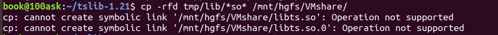

## 1、问题

### 1.1 unbuntu共享目录因文件系统导致ubuntu->Windows拷贝文件失败

**现象：**

通过共享文件夹从Ubuntu系统拷贝文件到Windows系统时出现如下错误



因tmp/lib目录中含有符号链接文件，而Windows系统不支持符号文件，所以拷贝失败

****

**处理方式：**

1、使用-L选项，强制将符号链接文件指向的实际文件拷贝过去

```sh
cp -rL tmp/lib/*so* /mnt/hgfs/VMshare/
```

## 2、二维数组的指针定义与初始化方式（malloc+calloc）

### 2.1 指针数据/（指针定义方式）二维数组的初始化与释放

#### 初始化：

```C
struct ts_sample_mt **samp_mt;
int nr = 2;
int i = 0;
samp_mt = malloc(nr*sizeof(struct ts_sample_mt *));
if (!samp_mt) {
    ts_close(ts);
    return -ENOMEM;
}
for (i=0;i<nr;i++)
{
    samp_mt[i] = calloc(max_slots, sizeof(struct ts_sample_mt));
    if (!samp_mt[0]) 
    {
        free(samp_mt);
        ts_close(ts);
        return -ENOMEM;
	}
}
```

### 释放：

```C
// 释放每个 struct ts_sample_mt 数组的内存
for (i = 0; i < nr; i++) {
    free(samp_mt[i]);  
}
free(samp_mt);  // 释放 samp_mt 指针数组本身的内存
```

### 2.2 malloc和calloc的区别

使用 `malloc` 可以省去初始化内存为零的开销，如果不需要初始化为零，这种方法更高效。

使用 `calloc` 可以确保所有内存块都初始化为零，如果初始化为零对你的程序有帮助，可以选择它。