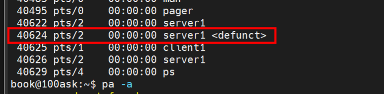
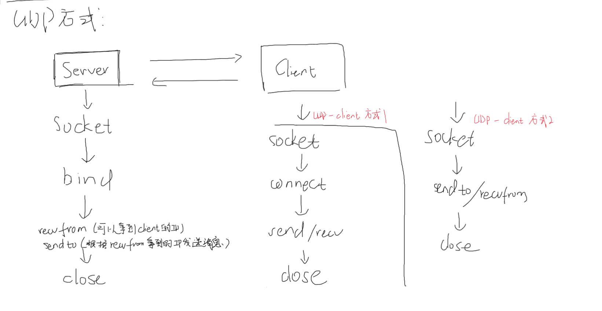
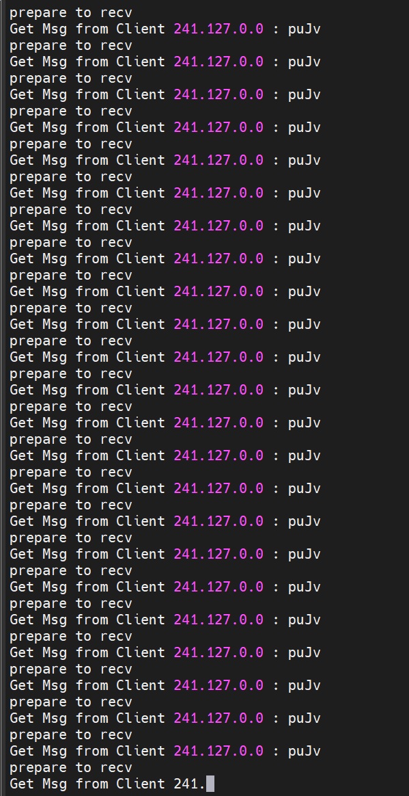

## 1、网络通信概述

### 1.1 IP 和端口

数据传输三要素：源、目的、数据长度

网络通信中，源和目的通过IP+端口来指定

### 1.2 网络传输中两个对象：server 和 client

传输的基本逻辑是：

client主动发起数据请求

server被动地响应数据请求

### 1.3 两种网络传输方式：TCP 和 UDP

#### 1.3.1 网络中的五个层：

**应用层**：直接为用户的应用进程提供服务

​	应用层协议包括HTTP（万维网应用）、SMTP（电子邮件）、FTP（文件传输）、DNS（域名解析服务）、Telnet等等

**运输层**（传输层）：为两个主机的进程网络通信提供传输服务，包括重传、成功校验等等

​	运输层的协议包括**TCP**（可靠、对传输结果负责）、**UDP**（不可靠，对传输结果不负责）

**网络层**：网卡层，对传输层的数据报分包发送，所以就包含**拆包**和**拼包**对应的内容

**链路层**：网络传输（两个主机之间）的路由过程，中间要经过很多交换机和路由器

**物理层**：数字电路层面，二进制比特位传输

#### 1.3.2 TCP和UDP的区别

TCP：面向连接，可靠传输、流量控制、拥塞控制

UDP：无连接服务，无可靠性、无流量控制、无拥塞控制

#### 1.3.3 UDP传输的特点

适用于类似视频传输的场景

1、应用数据发送时间控制更精细：即传即发，常用于不希望报文段延迟发送并且容忍一部分丢失的场景

2、无需建立连接，节省连接时的延迟

3、无连接状态，支持更多的活跃client

4、报文段首部数据开销小

#### 1.3.4 TCP和UDP的socket编程主要过程

**TCP-server：**

socket

bind

listen

accept

send/recv

close

**TCP-client：**

socket

connect

send/recv

close	

**UDP-server：**

socket

bind

send/recv

close

**UDP-client：**

socket

send/recv

close

## 2、网络编程的主要函数介绍

### 2.1 socket函数

```c
int socket(int domain, int type,int protocol);
```

**int domain：**使用的通讯协议栈

​	AF_UNIX：仅支持Unix系统内部进程间通讯

​	AF_INET：针对Internet，允许远程通讯

**int type：**网络通讯所采用的通讯协议

​	SOCK_STREAM：TCP协议

​	SOCK_DGRAM：UDP协议

**int protocol：**指定type时，该入参一般填0

**返回：**

成功：返回socket文件描述符fd

失败：返回-1，errno有指定错误原因

### 2.2 bind函数

将socket绑定IP地址和端口

```c
int bind(int sockfd, struct sockaddr *my_addr, int addrlen);
```

**int sockfd：**socket函数返回的文件描述符

**struct sockaddr *my_addr：**sockaddr结构体的指针类型（一般使用struct sockaddr_in类型，其兼容性更好）

```c
struct sockaddr_in{
unsigned short sin_family;
unsigned short sin_port;
struct in_addr sin_addr;
unsigned char sin_zero[8];
}

/*unsigned short sin_family:协议族，一般为AF_INET
 *unsigned short sin_port:server要监听的端口
 *struct in_addr sin_addr:真正的IP地址，server要监听的IP
 *unsigned char sin_zero[8]:一般在server中会初始化为0（memset(addr.sin_zero,0,8)）
 */
```

**int addrlen：**struct sockaddr_in结构体的长度

```c
sizeof(struct sockaddr_in)
```

**返回：**

成功：0

失败：-1，原因在errno中

### 2.3 listen函数

```c
int listen(int sockfd,int backlog);
```

**int sockfd：**bind后的socket文件描述符

**int backlog：**server可以监听的client连接队列长度

**返回：**

成功：0

失败：-1，原因在errno中 

### 2.4 accept函数

该函数调用时，会一直阻塞，直到接收到client的连接

```c
int accept(int sockfd, struct sockaddr *addr,int *addrlen);
```

**int sockfd：**listen后的server文件描述符

**struct sockaddr *addr**：client的IP+port，由client填写，server仅需要传指针

**int *addrlen：**struct sockaddr *addr长度，由client填写，server仅需要传指针

**返回：**

成功：client的socket文件描述符

失败：-1

### 2.5 connect函数

client向server发起连接的函数

```c
int connect(int sockfd, struct sockaddr * serv_addr,int addrlen);
```

**int sockfd：**client的socket函数返回的文件描述符

**struct sockaddr * serv_addr：**要连接的server的IP+port

**int addrlen：**struct sockaddr的长度

**返回：**

成功：0

失败：-1

### 2.6 send函数

client/server使用send函数向server/client发送数据

```c
ssize_t send(int sockfd, const void *buf, size_t len, int flags);
```

**int sockfd：**发送端的文件描述符

**const void *buf：**存放发送数据的buf

**size_t len：**buf的长度

**int flags：**一般设置为0

### 2.7 recv函数

client和server均使用该函数从TCP的另一端接收数据

```c
ssize_t recv(int sockfd, void *buf, size_t len, int flags);
```

**int sockfd：**数据源机socket文件描述符（）

**void *buf：**用来存储接收数据

**size_t len：**buf的长度

**int flags：**一般置零

**返回：**

成功：接收到数据的长度

失败：小于0

### 2.8 recvfrom函数

UDP协议下无连接的接收函数，可以拿到接收数据的IP+port

```c
ssize_t recvfrom(int sockfd, void *buf, size_t len, int flags,struct sockaddr *src_addr, socklen_t *addrlen);
```

**int sockfd, void *buf, size_t len, int flags：**同send函数

**struct sockaddr *src_addr：**数据源机的IP+port

**socklen_t *addrlen：**sizeof （ struct sockaddr）

### 2.9 sendto函数

UDP协议下无连接的发送函数，可以拿到发送数据的IP+port

```c
ssize_t sendto(int sockfd, const void *buf, size_t len, int flags,
const struct sockaddr *dest_addr, socklen_t addrlen);
```

**int sockfd, const void *buf, size_t len, int flags:**同send函数

**const struct sockaddr *dest_addr：**目的机IP+port

**socklen_t addrlen：**sizeof （ struct sockaddr）  

## 3、TCP编程

### 3.1 僵尸进程的处理

​	跟着韦东山老师把server和client的程序编写好后，我们在虚拟机上进行了一个server进程和两个client进程的网络通信实验。

​	发现在连接好后，如果用ctrl+c杀掉一个client进程，使用ps -a命令查看，会发现由如下僵尸进程出现：



我们只要在server程序main函数的前面加上这个，就可以让父进程忽略子进程的推出状态（信号、槽函数的方式），就不会再出现上述僵尸进程了：

```c
#include <signal.h>
signal(SIGCHLD,SIG_IGN);//注册信号接收后的处理函数(软中断方式)
```

### 3.2 字符串/整数 和 标准网络字符的转换函数

在使用socket相关网络函数时，IP、端口要使用标准网络字符格式

然后我们的IP通常以字符串的形式输入到程序，而端口号通常以int类型方式输入到程序

这时我们就需要使用转换函数将其转换成标准网络字符格式

```c
#include <netinet/in.h>
#include <arpa/inet.h>
#include <sys/types.h>          
#include <sys/socket.h>
#define PORT 8888

struct sockaddr_in server_addr;

server_addr.sin_port = htons(PORT);//将int类型端口号->标准网络字符格式

inet_ntoa(client_addr.sin_addr);//将标准网络格式IP->字符串

if (inet_aton(argv[1],&server_addr.sin_addr) == 0)//字符串IP->标准网络格式
{
    printf("IP format error\n");
    return -1;
}
```

## 4、UDP编程



### 4.1 server

不使用listen和connect，bind之后直接recvfrom，

而且也不需要创建多进程，我们在一个进程一直用recvfrom等（阻塞），有消息后就可以返回

> 不过发现了一个恶心的事情，向我们这种没有任何保护的UDP开放，容易招来恶意攻击（DDos）：
>
> 
>
> 这直接导致了我的UDP网络资源全部被占满了，server完全接不到client发来的消息（可恶，让坏蛋达到他想要做的目的了）

