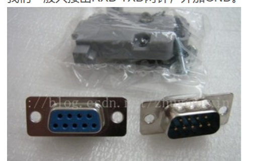

## 1、Linux系统中操作设备的统一接口

open

ioctl

read

write

## 2、Linux串口架构


**行规程：**

​	注意，正常默认状态下，对于UART的输入会收到行规程影响，APP段的read只有在Terminal传入换行的使用，才会有返回，并且返回的内容包括换行符。

​	所以我们在使用UART进行通讯时，就要注意设置行规程为RAW模式，有数据就返回。

## 3、Linux中UART编程的一般过程

1、open

2、设置行规程（通过封装ioctl实现了很多函数）

行规程的参数用结构体`struct termios`来表示：


3、read/write

## 4、Linux串口使用注意

### 4.1 VMIN/VTIME 和open函数的O_NONBLOCK参数的互相影响

**VMIN/VTIME：**是行规程配置结构体里面的两个参数，通过如下方式修改：

```c
#include <termios.h>

struct termios newtio;
bzero(&newtio,sizeof(newtio));
newtio.c_cc[VMIN] = 1;
newtio.c_cc[VTIME] = 0;
```

> 注意：这两个参数仅在open指定为阻塞方式时有效，否则（非阻塞）read函数将立即返回，不受这两个参数的影响

VMIN：读取数据时的最小字节数

VTIME：读取第1个数据时，未读到数据（1个都没有，哪怕有1个都不会返回）的超时时间，超时即返回。

**总结：**

1、如果你将 **`VTIME=0`** 并使用阻塞模式打开串口，那么 `read()` 将**一直阻塞**，直到接收到足够的数据（由 `VMIN` 决定）。此时，`VTIME` 并不会影响读取的行为。

2、如果你将 **`VTIME>0`** 并使用阻塞模式，则 `read()` 将根据 `VTIME` 的值设定一个超时时间，超时后 `read()` 可能返回，即使没有满足 `VMIN`。

## 5、优秀博文


[Linux串口编程 - feisky - 博客园 (cnblogs.com)](https://www.cnblogs.com/feisky/archive/2010/05/21/1740893.html)

[Linux串口—struct termios结构体-CSDN博客](https://blog.csdn.net/yemingzhu163/article/details/5897156)

## 6、串口硬件及电平扫盲

> 优秀博文：[图解快速区别——串口、COM口、UART、TTL、RS-232、RS-485_网口和串口的区别图片-CSDN博客](https://blog.csdn.net/zhuguanlin121/article/details/119137872)

### 6.1 概念

**1、串口、COM口指的是物理上的"串行通讯端口"，是总称**

**2、硬件上，串口分为“UART”和“D型9针串口”**

**3、电平信号上，分为“TTL”、“RS-232”和“RS-485”三种**

TTL电平：

​	bit0：0V

​	bit1:>3.3V

RS-232：

​	bit0：-15V

​	bit1：+15V

RS-485：

​	差分电压信号，和RS-232类型，抗干扰能力更强

**4、物理硬件接口和电平信号的对应关系：**

UART硬件：只能使用TTL电平


D型9针串口：RS-232或RS-485，**但我们一般只接出RXD TXD两针，外加GND**



> 无论如何，我们在Linux软件上的编程都是没有区别的