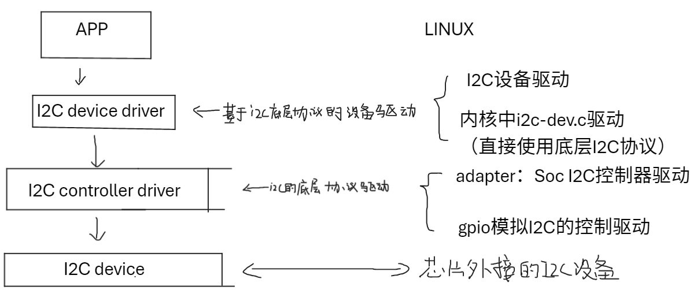
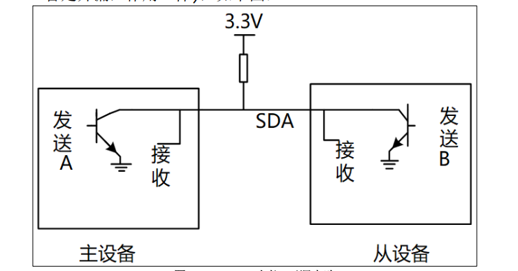
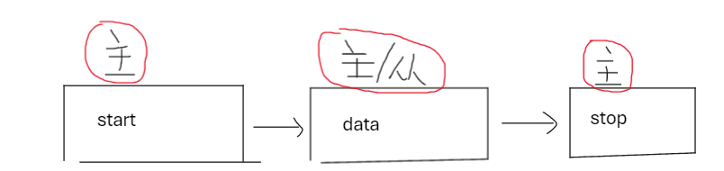
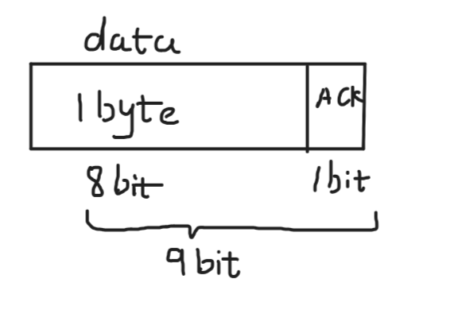
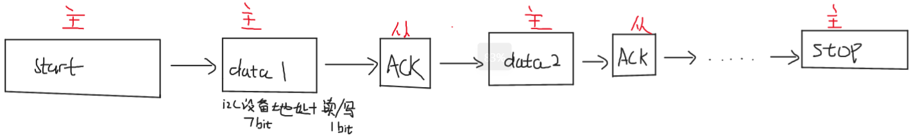
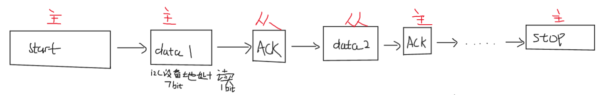
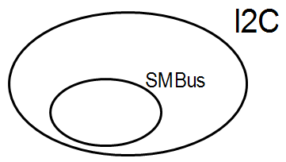

## 1、基本信息

### 1.1 硬件框架

I2C控制器→SDA线+SCK线（均有上拉电阻）→I2C设备

### 1.2 软件框架



> 单片机的I2C软件架构也差不多

## 2、I2C协议

### 2.1 硬件连接

#### 2.1.1 连接图


#### 2.1.2 SDA数据总线电路原理简图



- 通过三极管/CMOS管来驱动
- 主/从设备在SDA总线上既有out端，也有in端
- SDA总线上使用上拉电阻，以防止总线悬空时电平飘移

###  2.2 I2C数据传输格式

#### 2.2.1 传输数据主体

每次传输数据，包含主设备和从设备

主设备：Soc I2C controller

从设备：I2C设备


#### 2.2.2 串行总线的数字信号传输单元

1、I2C中仅有一个数据线SDA，每一个I2C设备在这条总线均连接了发送端和接收端

2、SDA数据总线以字节为传输单元

3、SDA串行总线数字信号传输流程：

 

4、对于“data”，包含9bit，前8个bit为要传输的字节，第9bit为`ACK`信号



5、SDA数据线使用`MSB`方式：先传输最高位

#### 2.2.3 写操作



#### 2.2.4 读操作



#### 2.2.5 I2C电平信号

SCK为高电平时：SDA信号有效，

SCK为低电平时，SDA信号无效，此时为data传输SDA总线电平变化的时间

> 注：
>
> 对于data数据
>
> 如果前八个数据由主设备驱动（通过三极管或CMOS管），那么第九个数据由从设备驱动
>
> 如果前八个数据由从设备驱动，那么第九个数据由主设备驱动

## 3、SMbus协议

### 3.1 基本信息

SMbus基于I2C协议，提出了一些更严格的要求



#### 3.1.1 SMbus的协议要求（在I2C协议的基础上）

​	要求更严格，详情见公开资料

#### 3.1.2 基础知识

##### 1、I2C controller支持的SMbus协议查看方法：Functionality flag

如果I2C controller支持某个SMBus功能，则会定义对应功能的宏，比如支持SMBus Quick Command：

```c
I2C_FUNC_SMBUS_QUICK
```

打印某个I2C总线支持的SMBus协议：

```shell
// I2CBUS为0、1、2的整数，代表哪条总线
i2cdetect -F I2CBUS
```

##### 2、一些符号的意思

```
S(1 bit)：开始信号
Sr(1 bit)：重复开始
P(1 bit)：停止
R/W#(1 bit)：读写
A，N(1 bits)：有回应，不需要回应
Address(7 bits)：I2C设备地址
Command Code(8 bits)：命令，一般为寄存器地址
Data Byte(8 bits):数据
Count(8 bits):block 长度
```

#### 3.1.3 SMBus协议主体

##### 1、SMBus Quick Command