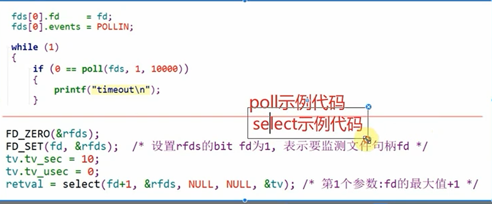

## 1、poll方式概述

使用`poll`系统调用定一个闹钟（timeout），poll有两种返回：1、有资源可读/可写； 2、闹钟超时。

根据poll的返回来判断是否调用`read/write` 或者 `其他`

## 2、poll的一般过程

1、使用poll方式时，open函数阻塞还是非阻塞都没有影响

2、定义一个`fds`数组，用来保存我们都需要检测哪些文件

3、`fds`结构体中，通过`event`来定义检测哪些事件

4、在执行`poll`函数前，每个需要监测的文件句柄`fd`都要设置好对应的`fds`结构体（遍历）

```c
fds[0].fd = fd;
fds[0].event = POLLIN;//输入事件，或者说监测可读事件
```

5、执行poll函数，指定“闹钟”（超时）时间

6、根据poll函数的返回，判断是超时还是有数据可读/写

7、读写处理/超时处理

......

## 3、select的一般过程

select函数也是闹钟机制，和poll函数类似，工作中，有时也可能遇到

select函数的坑好多.....

1、select的第一个参数是fd的最大值+1，而不是监测的fd的个数

2、tv（闹钟时间参数）在每次select返回时被修改，为倒计时剩余的时间。所以每次select调用前紧跟着就要重置这个值

3、rfds结构体通过宏函数来设置

> 注意：可以使用man手册中的示例参考编写程序！！！

## 4、poll函数和select函数两种方式的对比

