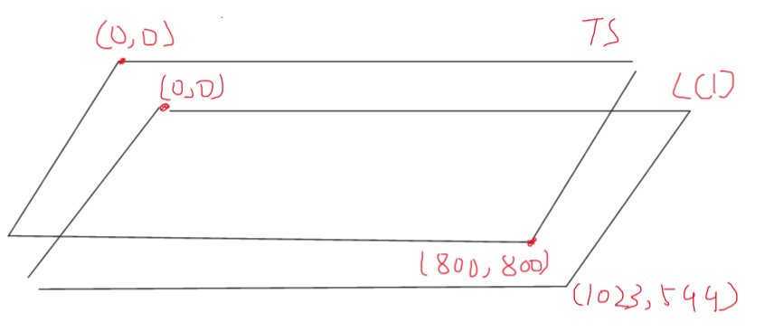
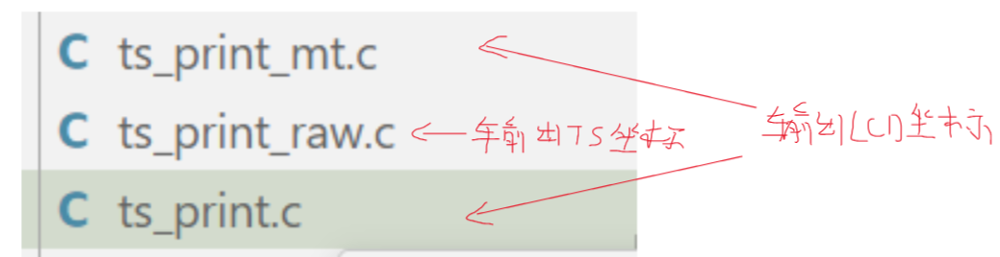

# 1、tslib框架分析

## 1.1 tslib官网下载源码主要内容

接口函数：APP使用tslib库的API

插件：tslib内置算法，通过config来配置

测试程序：tslib官方提供的触摸屏测试程序，可以直接编译并在目标板上运行

## 1.2 tslib程序主要框架

### 1.2.1 接口函数使用过程

**1、ts_setup(包含ts_open、ts_config)**

打开触摸屏设备节点（如果没有指定，就会依次从环境变量、默认节点、默认路径扫描三个方式中找）；

加载配置文件（配置文件主要是加载哪些插件）

> 配置文件内容示例：
>
> 

**2、ts_read\ts_read_mt(多点触摸屏)**

**3、ts_close**

### 1.2.2 主要数据对象

**tsdev：**

1、链表list：节点为通过配置文件中加载的普通模块

2、链表list_raw：input模块

> 说明：
>
> 在调用接口函数ts_read\ts_read_mt时，递归地调用tsdev中链表的每个模块；
>
> 两个链表（list\list_raw）会连接起来：tsdev.list中最后一个“module”会指向tsdev.list_raw的头部

# 2、交叉编译

# 3、自写测试程序 

1、valid非0时数据才有效

2、使用slot、tracking_id来标识一个触电

# 4、如何使用tslib

## 4.1 触摸屏+LCD结构及坐标转换

触摸屏（TS）和LCD的分辨率可能不同（大部分是相同的）

当点击触摸屏中的一个点的时候，既可以输出TS的原始坐标，也可以输出其对应的LCD坐标

tslib包含TS坐标到LCD坐标的映射算法（当然这也需要校准）

## 4.2 ts_print一般过程

1、读raw：读取触摸屏原始坐标数据

2、读校准文件：/etc/pointercal

3、处理：ts_raw→lcd(ts坐标转换成lcd坐标)

