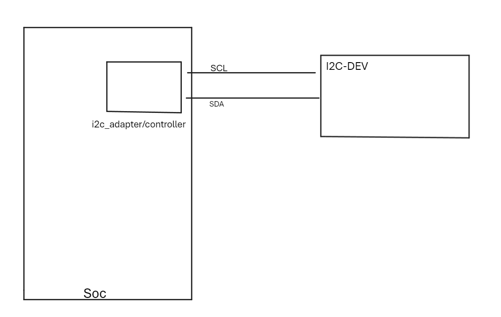

## 1、说明

以ap3216c为例子，需要：

## 2、编写代码的时候，我们需要

1、基于硬件连接，我们需要：确定i2c_controller;确定i2c_dev的地址，落实到代码就是open_i2c_dev、set_i2c_slave

2、想要读数据，需要先指定寄存器，落实到i2c协议上，就是写数据

3、通过写数据指定好i2c寄存器之后，马上读数据，就可以获得芯片某寄存器上的内容了

4、拿到原始数据之后，我们还需要根据芯片手册处理原始数据，以将结果用于其他用途

## 3、i2c原始协议的命令：i2ctrasfer

在Linux的shell中，如果想使用i2c协议直接在命令行读写某个i2c设备，可以使用`i2ctransfer`命令

## 4、其他

链接文件无法放到虚拟机的共享目录中！！！

应该是格式的限制！！！