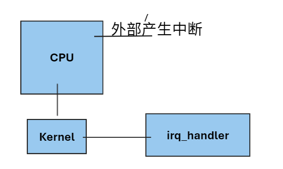
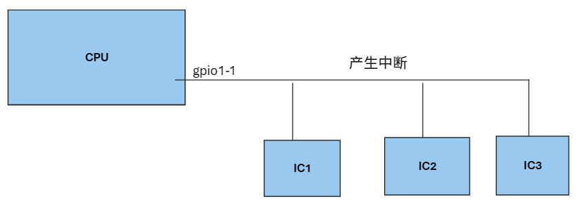

## 1 中断函数的使用

### 1.1 中断函数

```c
int err;
err = request_irq(unsigned int irq, irq_handler_t handler, unsigned long flags, const char *name, void *dev);
/* 1、unsigned int irq：中断号，纯软件概念，用以区分cpu中断类型（比如某一gpio引脚的按键中断）
 * 2、irq_handler_t handler：中断函数typedef irqreturn_t (*irq_handler_t)(int, void *);
 * 3、unsigned long flags：中断触发类型
 * 4、const char *name：用于调试的名字
 * 5、void *dev：内核调用中断函数时传给中断函数的指针
 */
```



### 1.2 中断函数的一般处理过程

###### a.分辨（中断类型）

​	中断函数首先要分辨当前中断是否为自己需要处理的中断。

​	**有时cpu一个pin外接多个设备：**

 

​	在上面的情况，就需要我们的代码去访问对应IC的寄存器（通过SPI/I2C协议寻址），然后确定是否为本中断函数需要处理的中断；

​	代码中，对于同一个irq，要申请三个中断函数：

```c
int irq;
int err;
struct gpio dev1,dev2,dev3;
irq = gpio_to_irq(gpio);
err = request_irq(irq, fun1, IRQF_TRIGGER_RISING | IRQF_TRIGGER_FALLING, "name1", &dev1);
err = request_irq(irq, fun2, IRQF_TRIGGER_RISING | IRQF_TRIGGER_FALLING, "name2", &dev2);
err = request_irq(irq, fun3, IRQF_TRIGGER_RISING | IRQF_TRIGGER_FALLING, "name3", &dev3);
```

​	无论哪个IC触发的CPU中断，内核都会调用上面三个函数，具体哪个来处理需要中断函数自己来判断。

​	反之，如果引脚外接只有一个IC，则不需要分辨中断类型。

###### b.处理

​	中断函数的代码逻辑。

###### c.清除（清除中断）

​	有些外设需要中断函数访问外部寄存器并清除中断源，否则中断将一直触发。

## 2 Linux中断使用的一些注意事项

### 2.1 注意

- **Linux并不是实时操作系统**，当前中断在进行处理时，其他中断可能会被推迟。比如网络中断的发生会抢占GPIO中断的资源，过程中gpio的中断可能会被触发，即使触发，也会被延后
- 申请中断要在设置gpio引脚为输出之后
- Linux系统中无法提高中断的优先级
- Linux系统可以取消中断，让进程一直占用CPU，而不被打扰，这样会导致程序卡死


