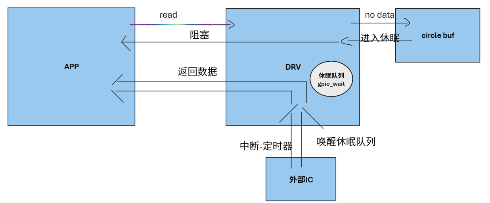
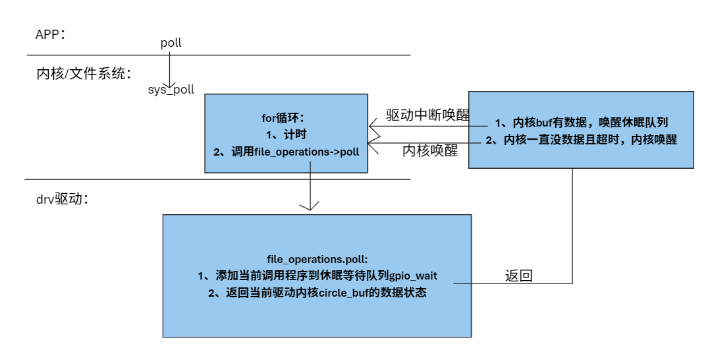

## 1 源码

> 注意：
>
> 1、阅读驱动源码时，从入口函数开始读
>
> 2、

```c
#include <linux/module.h>
#include <linux/poll.h>

#include <linux/fs.h>
#include <linux/errno.h>
#include <linux/miscdevice.h>
#include <linux/kernel.h>
#include <linux/major.h>
#include <linux/mutex.h>
#include <linux/proc_fs.h>
#include <linux/seq_file.h>
#include <linux/stat.h>
#include <linux/init.h>
#include <linux/device.h>
#include <linux/tty.h>
#include <linux/kmod.h>
#include <linux/gfp.h>
#include <linux/gpio/consumer.h>
#include <linux/platform_device.h>
#include <linux/of_gpio.h>
#include <linux/of_irq.h>
#include <linux/interrupt.h>
#include <linux/irq.h>
#include <linux/slab.h>
#include <linux/fcntl.h>
#include <linux/timer.h>

struct gpio_desc{
	int gpio;
	int irq;
    char *name;
    int key;
	struct timer_list key_timer;
} ;

static struct gpio_desc gpios[2] = {
    {131, 0, "gpio_100ask_1", },
    {132, 0, "gpio_100ask_2", },
};

/* 主设备号 */
static int major = 0;
static struct class *gpio_class;

/* 环形缓冲区 */
#define BUF_LEN 128
static int g_keys[BUF_LEN];
static int r, w;

struct fasync_struct *button_fasync;

#define NEXT_POS(x) ((x+1) % BUF_LEN)

static int is_key_buf_empty(void)
{
	return (r == w);
}

static int is_key_buf_full(void)
{
	return (r == NEXT_POS(w));
}

static void put_key(int key)
{
	if (!is_key_buf_full())
	{
		g_keys[w] = key;
		w = NEXT_POS(w);
	}
}

static int get_key(void)
{
	int key = 0;
	if (!is_key_buf_empty())
	{
		key = g_keys[r];
		r = NEXT_POS(r);
	}
	return key;
}


static DECLARE_WAIT_QUEUE_HEAD(gpio_wait);

// static void key_timer_expire(struct timer_list *t)
static void key_timer_expire(unsigned long data)
{
	/* data ==> gpio */
	// struct gpio_desc *gpio_desc = from_timer(gpio_desc, t, key_timer);
	struct gpio_desc *gpio_desc = (struct gpio_desc *)data;
	int val;
	int key;

	val = gpio_get_value(gpio_desc->gpio);


	//printk("key_timer_expire key %d %d\n", gpio_desc->gpio, val);
	key = (gpio_desc->key) | (val<<8);
	put_key(key);/* put the key value in the circle*/
	wake_up_interruptible(&gpio_wait);/* wake up the block Process in the queue*/
	kill_fasync(&button_fasync, SIGIO, POLL_IN);
}


/* 实现对应的open/read/write等函数，填入file_operations结构体   */
/* read two gpio value  */
static ssize_t gpio_drv_read (struct file *file, char __user *buf, size_t size, loff_t *offset)
{
	//printk("%s %s line %d\n", __FILE__, __FUNCTION__, __LINE__);
	int err;
	int key;

	if (is_key_buf_empty() && (file->f_flags & O_NONBLOCK))
		return -EAGAIN;
	
	wait_event_interruptible(gpio_wait, !is_key_buf_empty());/* app user use this func,so app to wait*/
	key = get_key();
	err = copy_to_user(buf, &key, 4);/* not config the key gpio type */
	return 4;
}

/*  kerbuf[0] is the gpio num definated by struct gpio_desc gpios[2]
	kerbuf[1] is the value of the gpio num
*/
static ssize_t gpio_drv_write(struct file *file, const char __user *buf, size_t size, loff_t *offset)
{
    unsigned char ker_buf[2];
    int err;

    if (size != 2)
        return -EINVAL;

    err = copy_from_user(ker_buf, buf, size);
    
    if (ker_buf[0] >= sizeof(gpios)/sizeof(gpios[0]))
        return -EINVAL;

    gpio_set_value(gpios[ker_buf[0]].gpio, ker_buf[1]);
    return 2;    
}


static unsigned int gpio_drv_poll(struct file *fp, poll_table * wait)
{
	//printk("%s %s line %d\n", __FILE__, __FUNCTION__, __LINE__);
	poll_wait(fp, &gpio_wait, wait);
	return is_key_buf_empty() ? 0 : POLLIN | POLLRDNORM;
}

static int gpio_drv_fasync(int fd, struct file *file, int on)
{
	if (fasync_helper(fd, file, on, &button_fasync) >= 0)
		return 0;
	else
		return -EIO;
}


/* 定义自己的file_operations结构体                                              */
static struct file_operations gpio_key_drv = {
	.owner	 = THIS_MODULE,
	.read    = gpio_drv_read,
	.write   = gpio_drv_write,
	.poll    = gpio_drv_poll,
	.fasync  = gpio_drv_fasync,
};


static irqreturn_t gpio_key_isr(int irq, void *dev_id)
{
	struct gpio_desc *gpio_desc = dev_id;
	printk("gpio_key_isr key %d irq happened\n", gpio_desc->gpio);
	mod_timer(&gpio_desc->key_timer, jiffies + HZ/5);
	return IRQ_HANDLED;
}


/* 在入口函数 */
static int __init gpio_drv_init(void)
{
    int err;
    int i;
    int count = sizeof(gpios)/sizeof(gpios[0]);
    
	printk("%s %s line %d\n", __FILE__, __FUNCTION__, __LINE__);
	
	for (i = 0; i < count; i++)
	{		
		gpios[i].irq  = gpio_to_irq(gpios[i].gpio);

		setup_timer(&gpios[i].key_timer, key_timer_expire, (unsigned long)&gpios[i]);
	 	//timer_setup(&gpios[i].key_timer, key_timer_expire, 0);
		gpios[i].key_timer.expires = ~0;
		add_timer(&gpios[i].key_timer);
		err = request_irq(gpios[i].irq, gpio_key_isr, IRQF_TRIGGER_RISING | IRQF_TRIGGER_FALLING, "100ask_gpio_key", &gpios[i]);


		request_irq(unsigned int irq, irq_handler_t handler, unsigned long flags, const char *name, void *dev)
	}

	/* 注册file_operations 	*/
	major = register_chrdev(0, "100ask_gpio_key", &gpio_key_drv);  /* /dev/gpio_desc */

	gpio_class = class_create(THIS_MODULE, "100ask_gpio_key_class");
	if (IS_ERR(gpio_class)) {
		printk("%s %s line %d\n", __FILE__, __FUNCTION__, __LINE__);
		unregister_chrdev(major, "100ask_gpio_key");
		return PTR_ERR(gpio_class);
	}

	device_create(gpio_class, NULL, MKDEV(major, 0), NULL, "100ask_gpio"); /* /dev/100ask_gpio */
	
	return err;
}

/* 有入口函数就应该有出口函数：卸载驱动程序时，就会去调用这个出口函数
 */
static void __exit gpio_drv_exit(void)
{
    int i;
    int count = sizeof(gpios)/sizeof(gpios[0]);
    
	printk("%s %s line %d\n", __FILE__, __FUNCTION__, __LINE__);

	device_destroy(gpio_class, MKDEV(major, 0));
	class_destroy(gpio_class);
	unregister_chrdev(major, "100ask_gpio_key");

	for (i = 0; i < count; i++)
	{
		free_irq(gpios[i].irq, &gpios[i]);
		del_timer(&gpios[i].key_timer);
	}
}


/* 7. 其他完善：提供设备信息，自动创建设备节点                                     */

module_init(gpio_drv_init);
module_exit(gpio_drv_exit);

MODULE_LICENSE("GPL");

```

## 2 代码核心内容拆解

### 2.1 面向对象的编程方法

定义结构体，以管理我们要操作对象的描述信息（），使用结构体数组管理对象实体。

```c
struct gpio_desc{
	int gpio;
	int irq;
    char *name;
    int key;
	struct timer_list key_timer;
};

static struct gpio_desc gpios[2] = {
    {131, 0, "gpio_100ask_1", },
    {132, 0, "gpio_100ask_2", },
};
```

### 2.2 使用中断+定时器消除机械按键抖动

###### a.按键的抖动

​	人在按动按键时，会产生抖动，触发多次中断，我们如何消除这些抖动，一次按按键只输出一次结果呢？

###### b. 方法

​	1、中断函数仅修改定时器的超时时间，使其延后：

```c
static irqreturn_t gpio_key_isr(int irq, void *dev_id)
{
	struct gpio_desc *gpio_desc = dev_id;
	printk("gpio_key_isr key %d irq happened\n", gpio_desc->gpio);
	mod_timer(&gpio_desc->key_timer, jiffies + HZ/5);
    /*
    修改超时时间：
    	1、jiffie为当前系统滴答（tick），受cpu定时器时钟频率影响，定时器时钟频率一般为100hz或1000hz
    	2、HZ为宏，1hz
    	含义是超时时间为当前系统滴答加上一小段时间
    */
	return IRQ_HANDLED;
    
    /*
    中断的几种返回：
        IRQ_NONE
        IRQ_HANDLED
        IRQ_WAKE_THREAD
    */
}
```

​	2、定时器超时函数中去读取gpio的值：

```c
static void key_timer_expire(unsigned long data)
{
	/* data ==> gpio */
	// struct gpio_desc *gpio_desc = from_timer(gpio_desc, t, key_timer);
	struct gpio_desc *gpio_desc = (struct gpio_desc *)data;
	int val;
	int key;

	val = gpio_get_value(gpio_desc->gpio);
	key = (gpio_desc->key) | (val<<8);
    
    
	put_key(key);/* put the key value in the circle*/
    
	wake_up_interruptible(&gpio_wait);/* wake up the block Process in the queue*/
    
	kill_fasync(&button_fasync, SIGIO, POLL_IN);/*发送信号*/
}
```


​	这样我们就可以在电平信号稳定之后再去读取gpio引脚值了


###### c.在入口函数中

```c
setup_timer(&gpios[i].key_timer, key_timer_expire, (unsigned long)&gpios[i]); 
/*1、struct timer_list key_timer：定时器对象
 *2、static void key_timer_expire(unsigned long data)：定时器超时函数
 *3、unsigned long data：调用定时器超时函数的入参
 */
gpios[i].key_timer.expires = ~0;/*设置定时器的超时时间为无穷大*/
add_timer(&gpios[i].key_timer);/*启动定时器*/
```

​	模板中的定时器在上述三行代码之后，永远都不会执行（超时时间为无穷大）。

### 2.3 环形buffer

​	常在嵌入式和硬件设备中，常用于事件或数据的缓存。

```c
#define NEXT_POS(x) ((x+1) % BUF_LEN)

static int is_key_buf_empty(void)
{
	return (r == w);
}

static int is_key_buf_full(void)
{
	return (r == NEXT_POS(w));
}

static void put_key(int key)
{
	if (!is_key_buf_full())
	{
		g_keys[w] = key;
		w = NEXT_POS(w);
	}
}

static int get_key(void)
{
	int key = 0;
	if (!is_key_buf_empty())
	{
		key = g_keys[r];
		r = NEXT_POS(r);
	}
	return key;
}
```

###### a.使用取模方式实现读写指针r\w的回环

```c
#define NEXT_POS(x) ((x+1) % BUF_LEN)
```

###### a.环形buf使用注意（数据完整性以及避免位溢出的问题）


- 放入和取出的数据类型要相同（位数一致，8bits）
- 放入和取出的数据类型位数不能超过环形buf数组定义的数据类型位数（32bits）


### 2.4 中断-以GPIO中断为例

###### a.通过gpio引脚号获得中断号

```c
struct gpio_desc{
	int gpio;
	int irq;
    char *name;
    int key;
	struct timer_list key_timer;
} ;
static struct gpio_desc gpios[2] = {
    {131, 0, "gpio_100ask_1", },
    {132, 0, "gpio_100ask_2", },
};
gpios[i].irq  = gpio_to_irq(gpios[i].gpio);/*通过gpio引脚号获得中断号*/
```

###### b.通过中断号申请中断资源，并指定中断触发方式和中断函数

```c
err = request_irq(gpios[i].irq, gpio_key_isr, IRQF_TRIGGER_RISING | IRQF_TRIGGER_FALLING, gpios[i].name, &gpios[i]);
/*
参数1：中断号
参数2：中断函数名
参数3：中断触发方式（上升沿、下降沿、高电平、低电平）
参数4：中断名称
参数5：传递给中断函数的指针
*/
```

###### c.定义中断函数

```c
static irqreturn_t gpio_key_isr(int irq, void *dev_id)
{
	struct gpio_desc *gpio_desc = dev_id;
	printk("gpio_key_isr key %d irq happened\n", gpio_desc->gpio);
	mod_timer(&gpio_desc->key_timer, jiffies + HZ/5);
	return IRQ_HANDLED;/*通过宏返回中断处理结果*/
}
```

###### d.注意

- 后面每次中断发生时，中断函数都会被调用
- 如果外设触发中断的频率较高，中断可能发生丢失（中断资源被其他优先级更高的中断所占用）
- 综上，中断的使用需要很谨慎


## 3 答疑

### 3.1 GPIO速率对LED点灯的影响

###### a.通过pinctrl子系统可以设置gpio指针的速率

###### b.速度越快，对外部电路的电磁干扰越大：

​	led不需要很快

​	而对于一些内存芯片，则需要快速访问，比如用gpio模拟i2c中

###### c.常用的gpio速率：10Mhz、20Mhz、50Mhz

### 3.2 几种打印函数

```c
printf("hello world"); /*打印到标准输出*/
fprintf(fd,"hello world");/*打印到某个文件*/
sprintf(buf,"hello world");/*打印到buf*/
printk("hello world");/*打印到内核，仅驱动用
```

## 4 交互流程解读

### 4.1 非阻塞方式

​	驱动程序在drv_read中需要判断文件的打开方式：`file->f_flags & O_NONBLOCK`

```c
if (is_key_buf_empty() && (file->f_flags & O_NONBLOCK))
	return -EAGAIN;
/*
	如果文件打开方式为非阻塞，并且环形buf为空，直接返回
	否则，读取数据并返回
*/
```

### 4.2 阻塞方式



###### a. APP：在open驱动文件时，不传入O_NONBLOCK参数

```c
fd = open("/dev/harry_led", O_RDWR);
```

###### b. DRV驱动：

​	在读函数中，执行:		（如果没有数据，则进入休眠等待队列）

```c
wait_event_interruptible(wq,condition)
/*
	condition：
	条件为假，则休眠，进入休眠等待队列gpio_wait中
	条件为真，这跳过本操作，执行下面的代码
*/
    
```

​	完整的驱动读函数如下：

```c
static DECLARE_WAIT_QUEUE_HEAD(gpio_wait);/*定义休眠队列*/

static ssize_t gpio_drv_read (struct file *file, char __user *buf, size_t size, loff_t *offset)
{
	//printk("%s %s line %d\n", __FILE__, __FUNCTION__, __LINE__);
	int err;
	int key;

	if (is_key_buf_empty() && (file->f_flags & O_NONBLOCK))
		return -EAGAIN;
	
	wait_event_interruptible(gpio_wait, !is_key_buf_empty());/* app user use this func,so app to wait*/
	key = get_key();
	err = copy_to_user(buf, &key, 4);/* not config the key gpio type */
	return 4;
}
```

​	在有数据时，唤醒休眠队列中休眠的进程：

```c
wake_up_interruptible(&gpio_wait);
```

​	本程序就是在定时器超时函数中唤醒休眠程序:

```c
static void key_timer_expire(unsigned long data)
{
	/* data ==> gpio */
	// struct gpio_desc *gpio_desc = from_timer(gpio_desc, t, key_timer);
	struct gpio_desc *gpio_desc = (struct gpio_desc *)data;
	int val;
	int key;

	val = gpio_get_value(gpio_desc->gpio);


	//printk("key_timer_expire key %d %d\n", gpio_desc->gpio, val);
	key = (gpio_desc->key) | (val<<8);
	put_key(key);/* put the key value in the circle*/
	wake_up_interruptible(&gpio_wait);/* wake up the block Process in the queue*/
	kill_fasync(&button_fasync, SIGIO, POLL_IN);
}
```

### 4.3 poll方式

### 	

###### a.驱动程序的poll函数进需要干两件事：

​	1、添加当前调用程序到休眠等待队列

​	2、返回当前驱动内核唤醒buf的数据状态（有数据 or 无数据）

```c
static unsigned int gpio_drv_poll(struct file *fp, poll_table * wait)
{
	//printk("%s %s line %d\n", __FILE__, __FUNCTION__, __LINE__);
	poll_wait(fp, &gpio_wait, wait);
	return is_key_buf_empty() ? 0 : POLLIN | POLLRDNORM;
}
```

###### b.驱动程序的中断函数/定时器超时函数 需要唤醒休眠等待队列（有数据唤醒）

## 4.4 异步通知


###### a. app需要的操作

```c
/*注册信号回调函数,func中读数据*/
signal(SIGIO,func);
/*打开驱动文件*/
open("/dev/harry_led",O_RDWR);
/*set owner*/
fcntl(fd,F_SETOWN,getpid());
/*设置异步标志*/
flags = fcntl(fd,F_GETFL);
fcntl(fd,F_SETFL,flags|FASYNC);
```

app后面在main函数就可以做其他事情了

###### b.drv需要的操作：在定时器超时函数中

```c
kill_fasync(&button_fasync, SIGIO, POLL_IN);/*发送信号*/
```

​	触发app执行读操作。