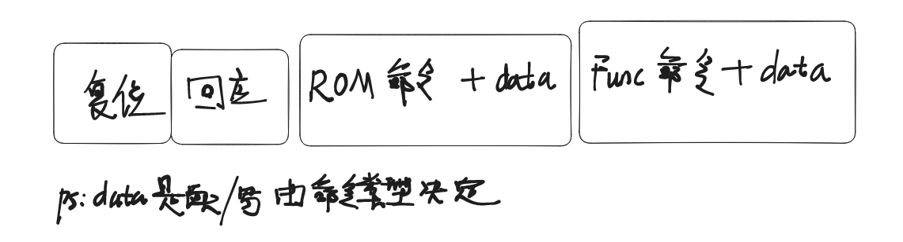

## 1、课堂随笔

### 1.1 DS18B20时序

****

### 1.2 嵌入式模块低功耗特性

​	嵌入式模块为了减少功耗，平时都是不工作的，当需要开始工作时，要初始化模块。

### 1.3 单总线单设备（1对1场景）

###### 1、GPIO在配置成输出引脚时是一定不会触发中断的

###### 2、前面时序命令已经基本明确了通讯的过程，那么关键就是如何读写数据

读写数据从读写一个bit开始

###### 3、由于单总线电平的变化过程存在1us级别，不适合使用中断，并且在数据读写过程，由于对时间极度敏感，整个通讯交互过程还需要【关中断】

###### 4、模块传输数据时从低位开始传

### 1.4 代码编写方法

#### 1、APP

open

read

#### 2、DRV

##### 2.1 ds18b20_read函数:

###### a.关中断

###### b.启动温度转换

发送cmd时，注意按位进行发送，八字节的命令先发送最低位。


###### c.恢复中断

###### d.delay 1s

​	1s种对于Linux系统来说很长，可以做很多事情，所以在此期间一定要把中断打开，不要让Linux系统在此期间卡死！

```c
/*wait the transfer time for 1s*/
set_current_state(TASK_INTERRUPTIBLE);
schedule_timeout(msecs_to_jiffies(1000));
/*
使用schedule_timeout会让drv进入休眠，而不占用cpu资源，但注意，使用前要设置状态，也就是set_current_state
*/
```


###### e.关中断

###### f.读数据

###### g.恢复中断

##### 2.2 内核里面基本不支持浮点数的除法运算，所以一般都用位来表示小数，不直接使用浮点数


##### 2.3 udelay这个函数有时候不太准，可以使用ktime_get_ns来精确判断时间（适用于时间高度敏感的场景）


##### 2.4 从低位开始发送的代码判断

```c
if(cmd & 1<<i)
{
    /*send 1*/
}
else
{
    /*send 0*/
}
```

​	逐位判断bit是0还是1，然后选择通过gpio发送0 or 1。

##### 2.5 对于读数据场景

```c
static void ds18b20_read_data(unsigned char *buf)
{
	int i;
	int val;
	unsigned char data;
	gpio_direction_output(gpios[0].gpio, 1);
	for (i = 0; i < 9; i++)
	{
		data = 0;
		gpio_direction_output(gpios[0].gpio, 0);
		ds18b20_udelay(2);
		gpio_direction_input(gpios[0].gpio);
		ds18b20_udelay(10);

		val = gpio_get_value(gpios[0].gpio);
		if (val)
		{
			data|=(1<<i);
		}
		else
		{
			/* code */
		}
	}
	
}
```

逐位读的话，首先需要一个值为0的初始值（data），然后根据gpio的value：

**从低位开始读：**

对1左移或等于上data。

**从高位开始读：**