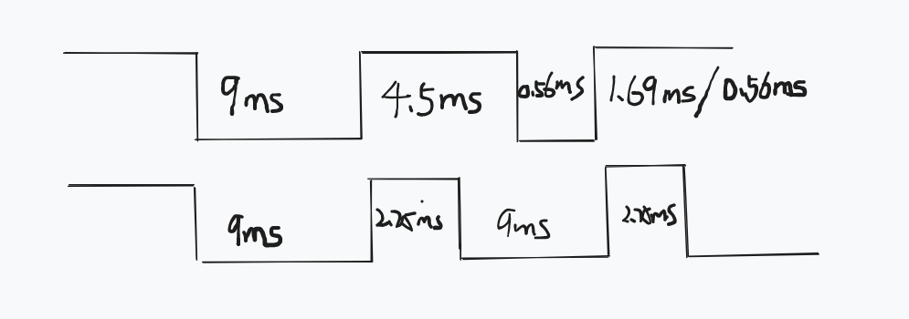
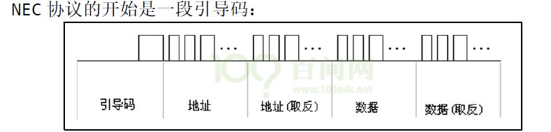

## 1 课堂随笔

### 1.1 红外遥控操作原理与编程思路

###### 1、1-wire单总线架构，且时序要求为ms级，可以使用中断，中断丢失的发生概率极低

​	即便如此，在驱动程序编写的过程中，还是需要考虑中断丢失的情况。

###### 2、只涉及单向传输，有irda模块主动发送电平信号

前面还在纠结使用哪种方式来编写驱动程序，这种单工单总线场景，貌似只有中断比较合适。

那我们只需要记录中断发生的时间，通过中断发生的时间间隔来判断信号的含义。

###### 3、软件架构

**APP**：

- open+read
- 通过死循环，每个很短一段时间读取数据，如果没数据，则阻塞，有数据，则返回
- 读函数读取内核环形缓冲区中的值

**DRV**：

- 中断触发记录中断时间，保存在内核全局变量中，同时对中断个数进行计数，
- 当记录的中断个数达到66个时，对中断进行数据解析(NEC协议)。

- 拿到的数据进行地址和数据的校验，如果数据无误，则将数据保存在内核环形缓冲区中，并唤醒等待队列。
- 在读函数中，判断环形缓冲区中是否有数据，如果有，取出并传递给APP；如果没有，进入休眠。

​	

​	