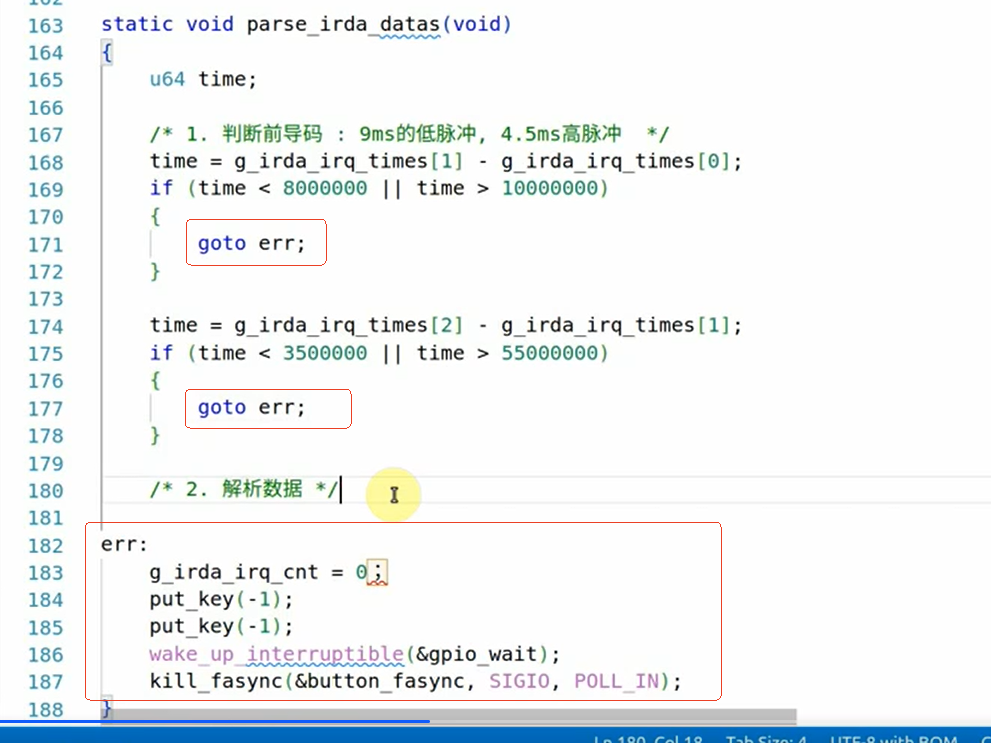
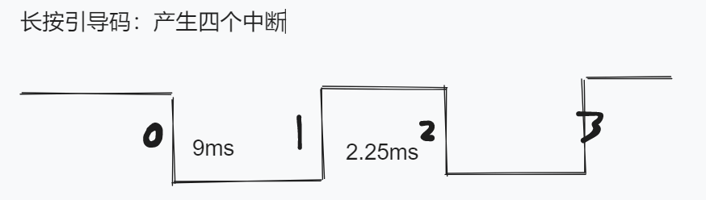

## 1 课堂随笔

### 1.1 红外遥控操作原理与编程思路

###### 1、1-wire单总线架构，且时序要求为ms级，可以使用中断，中断丢失的发生概率极低

​	即便如此，在驱动程序编写的过程中，还是需要考虑中断丢失的情况。

###### 2、只涉及单向传输，有irda模块主动发送电平信号

前面还在纠结使用哪种方式来编写驱动程序，这种单工单总线场景，貌似只有中断比较合适。

那我们只需要记录中断发生的时间，通过中断发生的时间间隔来判断信号的含义。

###### 3、软件架构

**APP**：

- open+read
- 通过死循环，每个很短一段时间读取数据，如果没数据，则阻塞，有数据，则返回
- 读函数读取内核环形缓冲区中的值

**DRV**：

- 中断触发记录中断时间，保存在内核全局变量中，同时对中断个数进行计数，
- 当记录的中断个数达到**66个**时，对中断进行数据解析(NEC协议)。

- 拿到的数据进行地址和数据的校验，如果数据无误，则将数据保存在内核环形缓冲区中，并唤醒等待队列。
- 在读函数中，判断环形缓冲区中是否有数据，如果有，取出并传递给APP；如果没有，进入休眠。

### 1.2 红外遥控驱动编程

注意：

1、读bit时，从高位开始还是从低位开始？

2、32位数据中四个字节的顺序是怎么样的？

3、环形buf的写入和读出顺序是如何的？（**先进先出FIFO**）

###### 1、引脚编号：GPIO4_19：3*32+19=115

###### 2、增加定时器以增加容错（在中断函数中启动定时器，修改超时时间）

###### 3、定时器超时函数中：向唤醒buf中传入一个异常值（比如-1），告诉应用程序出错了

###### 4、一次数据传输中应该有68个中断，因为最后一位传输需要判断高电平持续的时间，那么后续一定会多两个中断，差点完蛋！

###### 5、在parse_Data函数中判断前导码是否有效，如果无效，丢弃本次数据，并向环形缓冲区重传入一个异常值（-1），告诉APP数据异常。

###### 6、注意毫秒和纳秒的进制差别

1s = 1000ms = 1000,000,000ns 

###### 7、在parse_Data函数中的异常处理，使用了goto方法

我需要研究一下goto怎么用；

将goto方法应用到代码中。

****

###### 8、对于数据的解析过程，不在乎先传高位还是先传低位

###### 9、注意数据无论是错误返回还是正常返回，time_buf的cnt值都要清理归零

###### 10、DRV的读函数中，需要对从环形buf取出的值进行判断，如果值异常，那么返回给APP的return也应该是负数（-EIO）

### 1.3 红外遥控驱动上机实验

###### 1、GPIO引脚在不配置时默认是输入引脚

###### 2、对于得到的数据，是没问题的，看起来是韦老师程序的处理有问题

### 1.4 红外遥控驱动改进

###### 1、忽略了长按重复引导码：9ms低电平+2.25ms高电平

​	代码中需要增加对长按引导码的处理。

###### 2、中断数为4时，通过函数解析是否为重复码；在全局变量中保存上一次解析的内容；如果收到的是重复码，则将上一次解析得到的内容放入到环形缓冲区中；如果不是重复码，中断数为68，则正常解析数据，并赋值以覆盖全局变量。

###### 3、注意启动定时器的时机；每次解析到一个完整数据时，都需要delete_timer