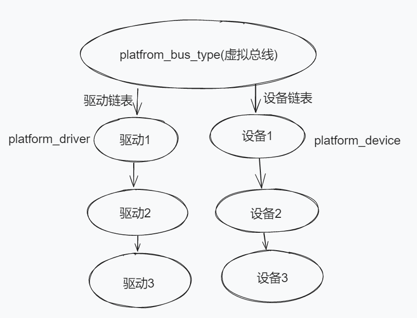
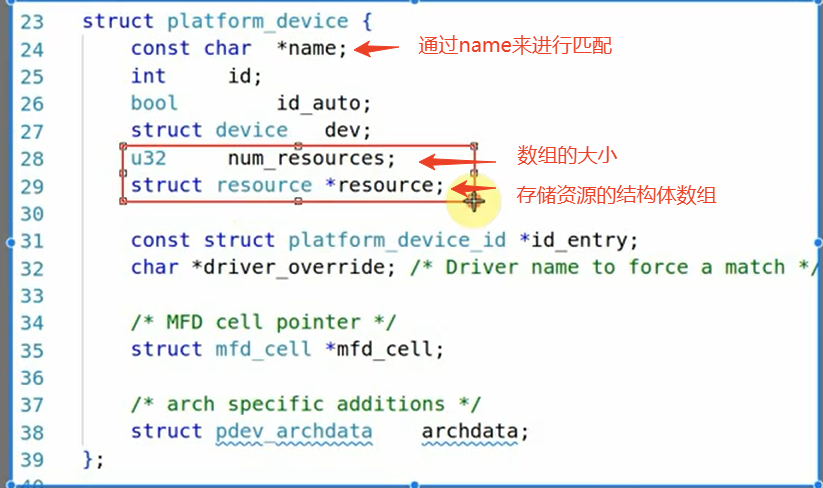
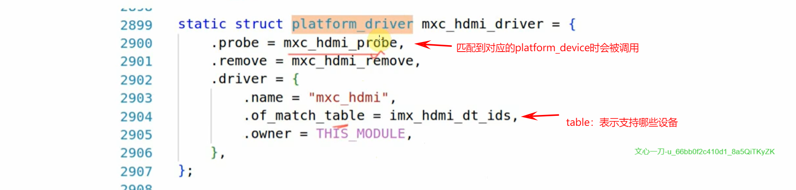
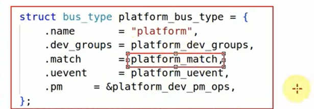

## 1 课堂随笔

### 1.1 平台总线设备驱动模型

#### 1.1.1内核中有一个虚拟的总线：platform_bus_type

#### 1.1.2 驱动程序中需要做如下事情：

###### 1、在内核总线中添加platform_device：platfrom_device_add(struct platform_device *pdev)

- struct platform_device *pdev含有硬件资源：寄存器地址、内存地址、中断号
- 该函数会在驱动链表中寻找是否有驱动支持本身，如果匹配成功（通过name），则会调用platform_device的probe函数

###### 2、在内核总线中添加platform_driver：platform_driver_register()

- 该函数在gpio_drv.c 的入口函数中被调用
- 完成resigster之后，会在设备链表中寻找是否有匹配的设备，如果成功找到，则通过platform_device来获得引脚编号等硬件资源，并调用结构体中的probe函数
- probe函数中进行原来驱动入口函数中需要做的事情：申请中断、申请gpio、创建定时器，注册file_operations结构体......

###### 3、platfrom_device和platform_driver如何匹配？

 两个结构体通过name进行匹配。

###### 4、分离的思想：基于平台总线驱动模型

分成两个.c文件进行开发：gpio_drv.c + gpio_dev.c

### 1.2 设备树的引入

> 设备树是Linux用来描述硬件信息的一种手段

###### 1、平台总线设备驱动结构体类型platform_bus_type

包含两个链表和一个匹配函数

###### 2、使用设备树来替代前面提到的gpio_dev.c

- 将设备信息保存在设备树文件中，由内核通过设备树的配置信息来自动在platform_bus_type中添加platform_device。
- Uboot启动：将SD卡中设备树文件读入到内存→载入SD卡中的uImage读入到内存→启动内核

​	

###### 3、最开始我们学习的内容其实把所有东西都放在代码里面了，这样也好理解，后面设备树和平台总线一引入，就会发现概念好多，涉及到的内容好多，但其实真正掌握之后，就会发现简单的修改就可以让设备支持产品

