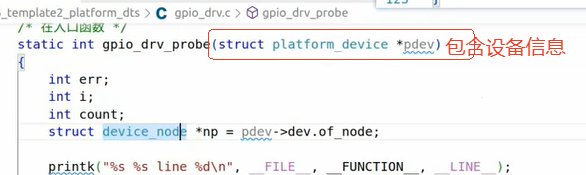
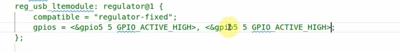
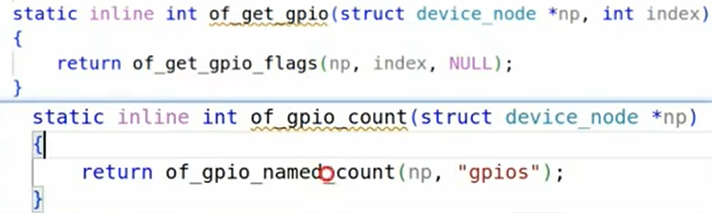
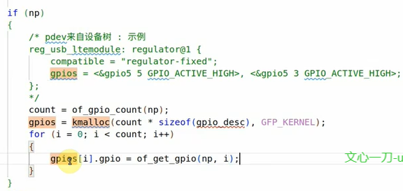
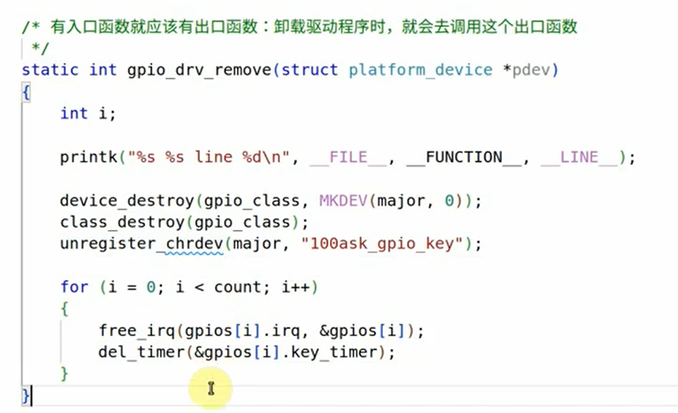
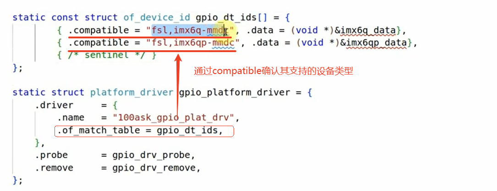

## 1 课堂随笔

###### 在platform_bus_type中，probe函数获取硬件信息的方法：①通过设备树文件获得②通过gpio_dev.c获得

### 1.1 gpio_drv.c获取设备信息的方法（以GPIO为例）



#### 1.1.1 通过设备树获得：核心是通过一些函数获得设备树中的内容

###### 1、设备树dts文件中关于设备节点的定义



​	可以看到dts文件中包含两个gpio引脚。

###### 2、获取匹配设备树gpios中包含的gpio数量：of_gpio_count



###### 3、通过索引获取gpio的引脚编号：of_get_gpio


###### 4、在内核中如果不确定数组的大小，可以先定义一个指针，然后通过kmalloc对内存大小进行动态分配（注意是kmalloc）。

注意：动态分配的存储空间中，不能再包含指针，原来的cha *name要改成数组char name[128]。



申请的内存需要在remove函数中进行释放：

```c
static int gpio_drv_remove(struct platform_device *pdev)
{
    int i;
    
    printk("%s %s line %d\n", __FILE__, __FUNCTION__, __LINE__);

    // 卸载时释放已分配的内存
    if (gpios) {
        for (i = 0; i < count; i++) {
            free_irq(gpios[i].irq, &gpios[i]);
            del_timer(&gpios[i].key_timer);
        }
        kfree(gpios);  // 释放通过 kmalloc 分配的内存
    }

    device_destroy(gpio_class, MKDEV(major, 0));
    class_destroy(gpio_class);
    unregister_chrdev(major, "100ask_gpio_key");

    return 0;
}

```

#### 1.1.2 通过.c文件获得硬件信息

​	这种方法不常用，在Linux4的字符设备内核驱动中甚至都没有！！！，了解一下即可，核心还是在于获得硬件信息并保存在内核空间。

### 1.2 remove函数

###### 1、使用remove函数做之前模版1中退出函数（exit）同样的事情：

###### 2、之前kmalloc申请的资源，需要在platform_driver -> remove函数中将其释放掉


### 1.3 of_match_table（platform_driver在设备树中支持的设备类型）



**主要通过compitable来进行匹配。**