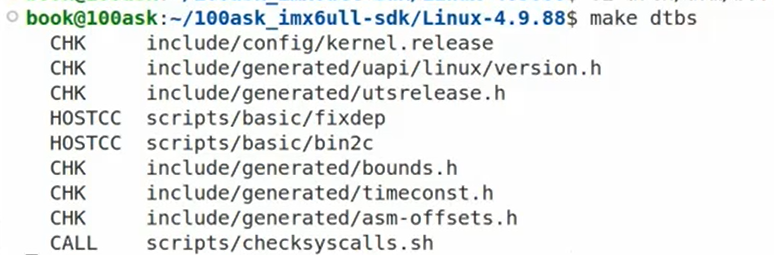

## 1 课堂随笔

### 1.1 使用平台总线设备驱动模型（设备树方式）

###### 1、通过文件对比工具（beyond compare）修改程序

###### 2、修改设备树，以添加设备节点

需要在设备树文件（.dts）中新增的内容：

```shell
motor{
	compatible = "100ask,gpiodemo",
	gpioS = <&gpio4 19 GPI0_ACTIVE_HIGH>,
			<&gpio4 20 GPI0_ACTIVE_HIGH>,
			<&gpio4 21 GPI0_ACTIVE_HIGH>,
			<&gpio4 22 GPI0_ACTIVE_HIGH>;
}

```

修改设备树文件：


在根目录下面添加motor节点：


修改好文件后执行命令`make dtbs`，以生成.dtb文件：




将.dtb文件放到开发板/boot目录下，并重启开发板。


###### 3、在开发板上装载驱动程序并测试

 ```shell
 # 查看设备树中当前的设备节点
 cd /sys/firmware/devicetree/base/
 cd motor
 ls -l 
 cat name
 # 查看设备树中的设备节点是否被内核转换成平台设备（platform_device）
 cd /sys/bus/platform/devices/
 ls -l
 cd motor 
 ```

###### 4、引入设备树的目的：

一个驱动程序可以兼容很多硬件，不同硬件/板子之间只要设备树文件不同即可，驱动程序可以相同。

不同硬件的设备树文件中：

- 硬件名称相同（compitable）
- 引脚资源的功能顺序相同（某个引脚对于驱动来说有什么作用，比如gpios的第一行引脚控制步进电机的1相，这就是引脚资源的功能顺序）
- 引脚资源的内容不同（GPIO编号，GPIO4_19\GPIO4_20）

### 1.3 手工注册dev（不使用设备树，通过gpio_dev.c保存设备信息）


