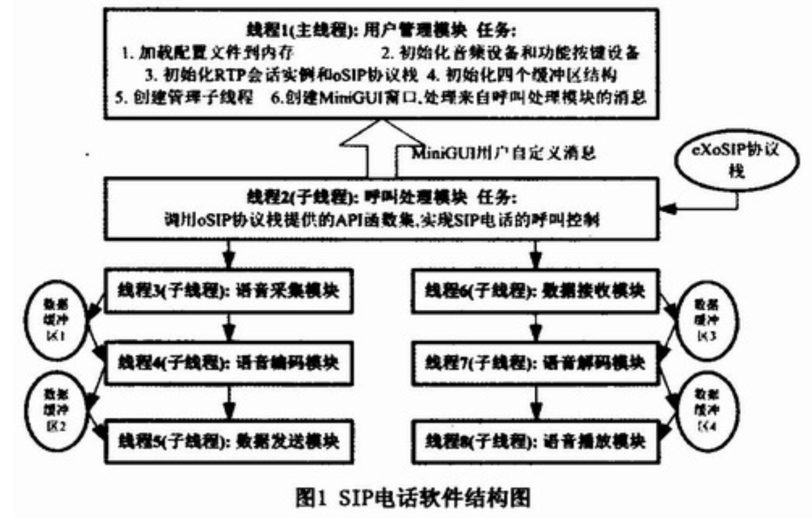

## 1. SIP的认知

**会话初始协议（Session Initiation Protocol）**是一种**信令协议**，用于初始、管理、终止网络中的语音和视频会话。

信令对于会话的管理由底层传输协议TCP或UDP来完成（推荐使用UDP），媒体信息的传送由SDP完成。

SIP与**RTP（实时传输协议）**和**SDP协议**关系密切。SIP与许多其它的协议协同工作，仅仅涉及通信会话的**信令部分(control message)**。

## 2. 网络案例整理

#### 基于嵌入式Linux和MiniGUI的SIP电话设计

> [基于嵌入式Linux和MiniGUI的SIP电话设计-AET-电子技术应用 (chinaaet.com)](https://www.chinaaet.com/article/83383#:~:text=基于嵌入式Lin,新性和商业价值。)
>
> **技术路径：**
>
> - 人机交互界面：Linux系统中的MiniGUI图形库+硬件LCD+硬件功能按键
> - 呼叫处理模块：硬件平台的网络接口：eXoSIP协议栈。信令（control message）协议为SIP
> - 语音的采集与播放：硬件平台的音频接口+Linux音频设备驱动
> - 语音的编码和解码：开源G.7-29A源代码
> - 语音的实时传输：使用RTP协议，开源的JRTPLIB库
>
> **软件架构：**
>
> 

