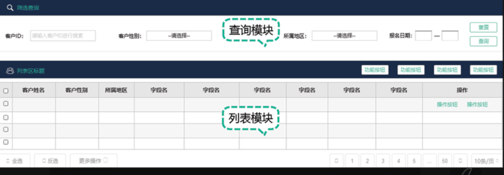
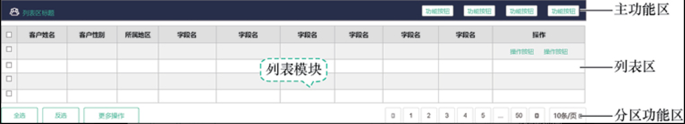
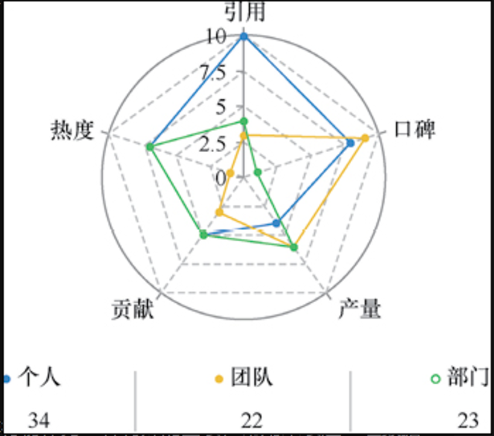
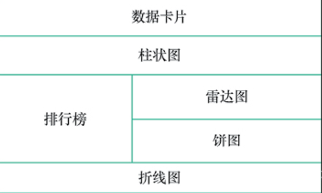

# 第五章 通用的产品功能设计方法

## 5. 数据列表的设计

> *应用场景*：
>
> 	1. 管理后台
>
> *主要组成*：
>
> 2. 查询模块：【搜索选择器】、【查询】、【重置】
> 3. 列表模块：【列表页】、【增删改查功能按钮】
>
> 

### 5.1 查询模块的设计

```
核心内容：组织查询指令，决定列表模块的显示内容
```

```
【搜索选择器】：
	1. 均来自列表模块的表头字段
	2. 各个搜索条件之间独立，搜索条件之间取交集
```

```
【查询】：
	1. 用于输入指令，执行查询
```

```
【重置】：
	1. 用于重置（清空）查询
```

### 5.2 列表模块的设计

```
核心内容：3个区域，【主功能区】、【列表区】、【分页功能区】
```



```
【主功能区】：数据操作功能（批量化、全局）
	1. “新增”
	2. “导出”
```

```
【列表区】：展示数据列表
 	1. 复选框
 	2. 最后一列作为“功能操作区”（针对某一行数据的功能）
```

```
【分页功能区】
	1. 使用分页器控件
	2. 控制每页显示条目以及跳转到指定页的功能
```

## 6. 数据看板功能设计

```
数据看板：原始数据可视化后称作图表，数据看板即是图表的集合
```

### 6.1 第一步：明确给谁看（用户需求）

### 6.2 选择合适的图表

```
不同的图表适合展示不同的数据
【数据卡片】：重要的静态指标
【柱状图】：适合表达对比
【折线图】：表达趋势
【饼图】：适合表达占比
```

1. 数据卡片：指标名称、指标数值（突出显示）、指标描述（解释专业指标）、辅助指标（可选）

   ```
   常用设计方式：
   	1. 【气泡卡片】控件
   	2. 鼠标单击或者移入时，显示指标释义
   ```

2. 柱状图：一般用于单维度、单度量的比较分析

3. 折线图：单维度、单度量的趋势分析

4. 饼图：单度量中不同维度的占比关系（用数字标明占比情况）

5. 漏斗图：递进流程的分析，对环节之间进行比较（比如转化率）

6. 雷达图：单对象在各个维度上的情况，整体反应事物的情况

7. 排行榜：表达某组数据的排名情况

### 6.3 确定图表布局

1. 以**框格**（数据看板的最小单元）为基本单位。一张框格可以容纳一张或者多张图表
2. 将数据看板看成多行/多列的框格
3. 根据用户眼球的浏览习惯，将重要的图表从上到下、从左到右填充进框格
4. 根据图表实际大小决定每一个框格容纳的图表数量
5. 对于大小差异很大的图表：如果某个特定的图表和其他图表的高度差距很大，则它可以放在一个大的**行框格**中，然后再把其他较小的图表容纳进来