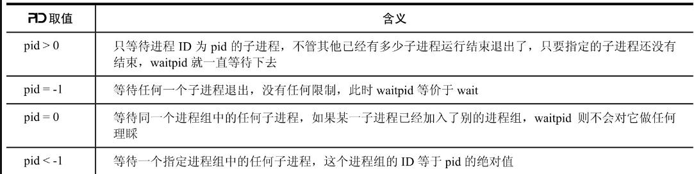
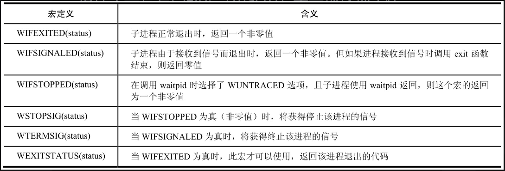

# 1.进程的基本概念

## 1.1 Linux进程简介

### 1.1.1**进程的定义：在自身的虚拟地址空间运行的一个单独的程序。**

> 进程的四要素：
>
> 1.一段供进程执行的程序；
>
> 2.进程专用的系统堆栈空间，也叫进程空间；
>
> 3.进程控制块，Liunx的具体实现为task_struct；
>
> 4.独立的存储空间。

### 1.1.2 Linux系统所有进程都是由进程号为1的init进程复制而来

### 1.1.3 进程树

根为init，其他进程都是fork来的。

### 1.1.4 进程的分类

**交互进程**：由shell启动的进程，分为前台进程和后台进程。

**批处理进程：**bash脚本，是一个进程序列。

**监控进程（守护进程）：**Linux系统启动时启动的进程，并在后台运行。

## 1.2 进程与作业（task）

**作业**：包含一个或多个进程，是当前正在执行的进程。（shell中）

```shell
nroff -man ps.1 | grep kill |more
```

**作业控制：**控制正在运行的进程的行为。比如挂起、重新执行进程；管道、重定向等shell命令。属于shell的特性。（内核会保存挂起进程的上下文）

## 1.3 进程标识

**PCB：**Process Control Block，进程控制块。进程创建时由内核分配。

> **PCB应包含的一些信息：**
>
> **1.进程标识符（Process ID）**：每个进程唯一拥有。非负整数。
>
> 2.进程当前状态：就绪、等待、执行。内核包含就绪进程队列、等待进程队列（等待打印机队列、等待磁盘IO队列等）；
>
> 3.进程相应的程序和数据地址；
>
> 4.进程资源清单：拥有的IO设备，打开的文件列表等。
>
> 5.进程优先级：可由用户指定和系统设置。
>
> 6.CPU现场保护区：挂起进程的CPU执行上下文。
>
> 7.进程同步与通信机制：信号量等。
>
> 8.进程所在队列的PCB链接字：指向当前进程队列下一进程的指针（链表结构）
>
> 9.进程其他信息：进程记账信息、进程占用CPU的时间（多核CPU之间是累加的关系）。

---

> **专用进程及其进程ID**：
>
> PID=0：调度进程（swapper交换进程），内核的一部分。
>
> PID=1：init进程。程序文件在/sbin/init（老UINX在/etc/init）。

---

> **进程组和会话：**
>
> 进程组（process group）：一个或多个进程合起来。
>
> 会话（session）：一个或多个进程组。
>
> 用于对进程批量操作：比如对进程组发送信号相当于对其中每个进程都发送信号。

---

> ```shell
> #罗列当前系统正在运行的所有进程
> ps
> #列出每一个进程的详细信息
> ps -aux
> ```

### 1.1 获取当前进程的PID

```c
#include <sys/types.h>
#include <unistd.h>
//pid_t其实和int类型完全兼容
pid_t getpid(void);
```

# 2. 进程控制的相关函数

## 2.1 fork和vfork函数

#### 2.1.1 fork函数

**系统调用fork：用于派生进程**

```c
#include <sys/types.h>
#include <unistd.h>
pid_t fork(void);
/*
1.返回：父进程中返回子进程ID；子进程返回0；出错返回-1。
2.子进程从父进程得到数据段和堆栈段的拷贝，并分配新的内存；只读的代码段，通常为共享内存形式；
3.用途：进程复制自身，父子进程执行不同的代码段；进程想执行另外一个进程。
4.fork返回后，子进程和父进程都从调用fork函数的下一条语句开始执行。所以代码可以在fork后面使用if测试来区分父进程代码和子进程代码。
*/
```

**fork创建子进程的代码编写方式：**

```c
#include <sys/types.h>
#include <unistd.h>
#include <stdio.h>
int main(void)
{
    int count = 0;
    pid_t pid;
    pid = fork;
    if(pid<0)
    {
        printf("error in fork!");
        exit(1);
    }
    else if(pid==0)
    {
        printf("I am the child process! My PID is %d\n", getpid());
        exit(1);
    }
    else
        printf("I am the father process! My PID is %d\n",getpid());
    return 0;
}

/*
父子进程的区别：
1.fork返回的pid不同；
2.进程PID也不同。
3.fork函数真的很奇妙，一次调用可以有两个返回值！！！！
4.fork返回值=负数（出错）的可能：系统进程数已经达到上限（errno=EAGAIN）；系统内存不足（errno=ENOMEM）
*/
```

**errno说明：**

> 1. Linux下的一个宏定义常量；
> 2. Linux C-API函数发生异常时，其值不同；
> 3. 使用其需要`#include <errno.h>`；
> 4. 相关的声明在路径/usr/include/asm/errno.h中。
> 5. 查看该值可以推测出错的原因，有的时候可以解决很多莫名奇妙的问题。

#### 2.1.2 vfork函数

**函数特点：**

```c
#include <sys/types.h>
#include <unistd.h>
pid_t vfork(void);

/*
与fork的关系：
1.返回类型与fork()函数相同；
2.fork会拷贝数据段和堆栈段，而vfork不会拷贝父进程的数据段，vfork执行之后，execve或exit执行之前，与父进程共享数据段；
3.fork执行后，父子进程没有次序之分；而vfork执行之后，父进程挂起，子进程先运行，待子进程调用了exec或exit之后，父子进程的执行次序才无限制；
4.实际其创建的不是进程，而是线程（因与父进程共享数据段，故缺少四要素之一：独立的内存资源）；
5.由于堆栈段是用于存放函数调用和全局变量、静态变量的，父子进程不共享。
*/
```

**例子：**

```c
#include <sys/types.h>
#include <unistd.h>
#include <stdio.h>
int main(void)
{
    int count = 1,i;
    int pid;
    printf("创建进程前，count=%d",count);
    if(pid = vfork() < 0)
        printf("vfork error!");
    else if (pid=0)
    {
        for(i=0;i<10;i++)
        {
            printf("son is running! i=%d",i);
        }
        printf("this is vfork son! count=%d,my PID = %d",++count,getpid());
    	exit(1); 
    }   
    else
         printf("SON is over ,this is vfork son! count=%d,my PID = %d",count,getpid());
    return 0;
}

/*
从打印结果可以看出，子进程修改的count值，在父进程空间中也生效，说明vfork得到的父子进程共享数据段！
*/
```

#### 2.1.3 一些例子


## 2.2 exec函数族

### exec函数族的作用

在调用进程内部执行一个可执行文件（二进制、脚本）

```c
#include <unistd.h>
int execl (const char *pathname, const char *arg, ...);
int execlp (const char *filename, const char *arg, ...);
int execle (const char *pathname, const char *arg, ..., char *const envp[ ]);
int execv (const char *pathname, char *const argv[ ]);
int execvp (const char *filename, char *const argv[ ]);
int execve (const char *pathname, char *const argv[ ], char *const envp[ ]);
```

| 函数名 | 调用程序指定方式                                             | 参数列表指定方式                     | 环境变量指定方式         |
| ------ | ------------------------------------------------------------ | ------------------------------------ | ------------------------ |
| “l”    |                                                              | 多个参数，最后一个为NULL             | 系统环境变量             |
| “v”    |                                                              | 字符串数组指针argv，数组内以NULL结束 | 系统环境变量             |
| “p”    | 环境变量PATH中搜索filename（没有“p”的函数需要用程序的路径来指定） |                                      | 系统环境变量             |
| “e”    |                                                              |                                      | 字符串数组指针envp来指定 |

### exec函数族特点

- 执行成功不返回任何值，执行失败则返回-1
- 进程内部调用其他程序
- 调用该函数的进程代码段、数据段和堆栈段全部焕新，只有进程ID等“表面功夫”保留
- 执行成功受执行文件位置、权限等多因素影响
  - 使用exec函数族时一定要包裹错误判断语句 

### 程序的main函数刨析

```c
int main(int argc, char *argv[], char *envp[]);
```

以下述例子说明

```shell
# ./main -xx 000
```

|     形参     |            解释            | 例子含义               |
| :----------: | :------------------------: | ---------------------- |
|   int argc   |     程序命令行参数个数     | 3（int，“./main”也算） |
| char *argv[] | 所有命令行参数，以NULL结尾 | ./main -xx 000         |
| char *envp[] |  所有环境变量，以NULL结尾  | 系统默认环境变量       |

### Linux中的环境变量

**形式：**“XXX=xxx”（变量名=值）

**解释：**一组值，用户登录后就一直存在，标明系统的一些细节

**例子：**PATH（程序的路径，比如/bin）、HOME（用户目录）

### 拓展：perror函数的说明

**作用：**将上一个函数发生错误的原因输出到标准出错中（stderr）；同时打印
“字符串s+全局变量errno的值（错误原因）”

```c
#include<stdio.h>
void perror(const char *s);
```

## 2.3 exit和_exit函数

### 两函数基本对比

```c
#include <stdlib.h>
void exit(int status);

#include <unistd.h>
void _exit(int status);
```

|       | 声明规范 | 头文件              | 功能                                                         | 特点                                           |
| ----- | -------- | ------------------- | ------------------------------------------------------------ | ---------------------------------------------- |
| exit  | ANSI C   | #include <stdlib.h> | 退出当前进程，并做好善后工作（在调用之前检查文件打开情况，把文件缓冲区的内容写回文件） | 让进程安全退出；对“高级IO”没有影响             |
| _exit | POSIX.1  | #include <unistd.h> | 退出当前进程（直接使进程停止运行，清除其使用的内存空间，销毁内核中的各种数据结构） | 让进程立即死掉，多一秒都烦；对“高级IO”产生影响 |

### main函数的返回说明

- 规范上，main函数使用return来返回，毕竟定义上是int main（）；
  - 有些编译器（Cygwin，C编译程序），不适用return返回会报warning(control reaches end of nonvoid function)
  - 如果不使用return，可以在定义main的时候使用**void** main();进行声明，然后用exit退出
  - 学到了C程序主要分为两大类，C编译程序（一般的C程序）和UNIX程序（跑在UNIX系统中的程序）

### Linux中的“高级IO”

**说明：**所谓高级IO，就是读写使用内存缓冲区的IO。有时，高级IO遇到/n等才去读写。

**例子：**printf、fopen、fread、fwrite

**影响说明：**高级IO不触发读写条件的内容都会在_exit调用之后丢失，影响进程正常逻辑

## 2.4 wait和waitpid函数

**僵尸进程(Zombie)：**

​	进程调用exit之后，并不会马上消失掉，而是立马留下一个成为僵尸进程（Zombie）的数据结构。

​	一般用wait和waitpid函数对其进行处理。

**僵尸进程的特点：**

- 不占有任何内存空间
- 没有任何可执行代码
- 不能被调度
- 仅在进程列表中保留一个位置：记录该进程的退出状态等信息

**wait和waitpid：**

```C
#include <sys/types.h>
#include <sys/wait.h>
pid_t wait (int *status);
pid_t wait_pid(pid_t pid, int *status, int options);
/*两个函数的返回：
成功：返回进程ID
出错：-1
*/
```

**进程调用wait后的作用：**

- 进程立即进入阻塞状态
- 分析当前进程的某个子进程是否已经退出
- 如果找到子进程为僵尸进程，则收集僵尸子进程的信息并将其彻底销毁
- 如果没有找到僵尸子进程，wait一直阻塞，直到其出现

**wait函数解析：**

- 任何一个子进程退出均结束等待，wait函数正常返回
- 形参int *status：被收集进程退出时的一些状态
  - 如果对这个状态不感冒，仅仅想把这个僵尸进程消灭掉，可以传入NULL

```c
pid=wait(NULL);
```

- 结果说明：
  - 成功：返回被收集的子进程ID（僵尸进程）
  - 失败：（没有子进程）返回-1，errno=ECHILD

**waitpid解析：**

- 与wait不同的是，其可以指定要等待的进程（pid参数指定）
  - 
- 可以使当前进程不挂起而立即返回
- option提供额外选项来控制waitpid，Linux中可以使用3个值：
  - WNOHANG：没有子进程退出，也会立即返回，而不会像wait一样阻塞当前进程
  - WUNTRACED：略（涉及跟踪调试、用的很少）
  - 0：不做任何选项
- linux内核源码目录中，wait实际上就是调用的waitpid
- 返回值说明：
  - 正常：返回收集到的子进程PID
  - option设置了WNOHANG，且调用时没有已退出的子进程：返回0
  - 调用中出错：返回-1，errno设置成对应的出错指示
    - 比如：pid指示的进程不存在或不是当前进程的子进程，则会返回-1，errno=ECHILD

**int *status的说明：**

- 是一个整形的指针变量
- wait会让其指向一个整形值status，其表明了子进程是否正常退出、正常退出时的返回值、子进程被哪一个信号结束的等信息
- 上述值存放在status指向的整数中的不同二进制位中
- 由于status不太好阅读，内核使用一套专门的宏来表述上述状态
  - 
  - 常用的是WIFEXITED(status)和WEXITSTATUS(status)
    - WIFEXITED返回0：子进程异常退出，WEXITSTATUS无意义
    - WIFEXITED返回非0：子进程正常退出，WEXITSTATUS表示子进程的退出状态，如果子进程以exit(5)退出，则WEXITSTATUS=5

**使用status的wait函数调用方法：**

```c
        #include <sys/types.h>
        #include <sys/wait.h>
        #include <unistd.h>
        #include <stdio.h>
        int main(void)
        {
            int status;
            pid_t pc,pr;
            if ((pc = fork()) < 0)
            {
                printf("error in fork!");
                exit(1);    /*fork出错退出*/
            }
            else if(pc==0)
        {  /*子进程*/
                printf("This is child process with pid of %d.\n",getpid());
                exit(3);   /*子进程返回3 */
            }
            else
        {   /*父进程*/
                pr=wait(&status);
                if(WIFEXITED(status))
        {   /*如果WIFEXITED返回非零值*/
                      printf("the child process %d exit normally.\n",pr);
                      printf("the return code is %d.\n",WEXITSTATUS(status));
                  }
        else
        {   /*如果WIFEXITED返回零 */
                      printf("the child process %d exit abnormally.\n",pr);
        }
            }
        return 0;
        }
```

**wait3和wait4函数：**

```c
#include <sys/types.h>
#include <sys/time.h>
#include <sys/resource.h>
#include <sys/wait.h>
pid_t wait3 ( int *status, int options, struct rusage *rusage);
pid_t wait4 ( pid_t pid, int *status, int options, struct rusage *rusage);
```

- 作用与wait、waitpid相同
- 额外多了一个结构指针rusage，指向一个结构缓冲区
- 调用wait3和wait4时，如果rusage不为null，则rusage指向的缓冲区会被写入子进程占用的resources情况（子进程执行时的相关信息）
- 其他与wait和waitpid相同
