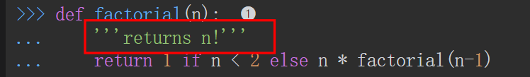
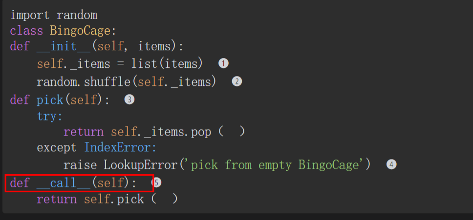
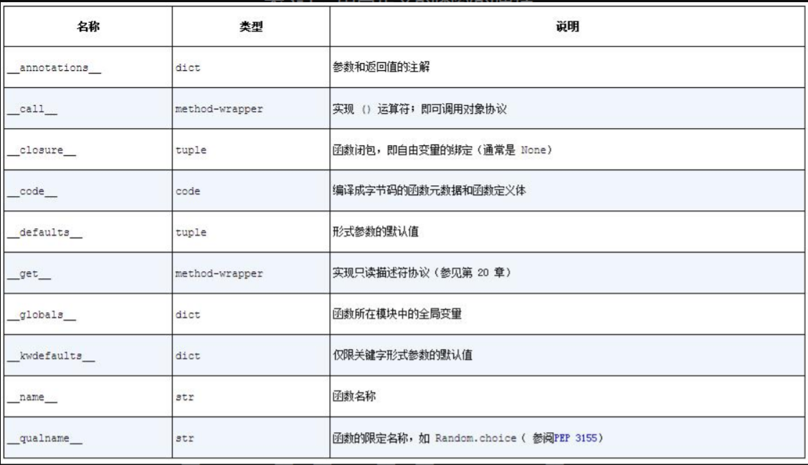

# 第五章

## 5.1 把函数视作对象

- 何为一等对象？
  - 一等对象就是任何地方都可以用的对象，比如字符、字典都是一等对象
  - 我们可以把函数赋值给变量，然后通过变量调用
  - 还可以把函数作为参数传递给另一个函数
- python中的函数本质上都是function类的实例
- python中的函数中第一行的""" """注释是function类的__doc__属性，是函数实例的帮助文本

**map函数介绍：**

​	把第一个参数（一个函数对象）应用到第二个参数（可迭代对象）上，然后返回一个生成器（可迭代对象）

### 5.2 高阶函数：函数式风格编程

**定义：**函数作为参数、返回结果为函数

**例子：**map（被取代）、sorted、filter（被取代）、reduce、apply（被取代）

**python3的新特性取代的一些旧方法：**

| 旧方法 | python3新特性                                                |
| ------ | ------------------------------------------------------------ |
| map    | 列表推导/生成器表达式：[**输入的函数** **for循环主体** **if判断**] [fact(n) for n in range(11) if n%2==0] |
| filter | 列表推导/生成器表达式                                        |
| reduce | 对可迭代对象的求和场景由sum替代                              |

### 5.3 匿名函数

**意义：**为了使用高阶函数，有时创建一次性的小型函数更便利。这便是匿名函数存在的意义

**关键字：**lambda

**特点：**定义体内不能复制，也不能使用while、try等python语句；只能定义一些及其简单的函数

**适宜应用场景：**函数的参数列表中

**缺点：**难以阅读；难以写出；很少应用

**对lambda函数的代码重构方法：**

1. 编写注释说明
2. 研究一会注释，并找出一个名称来概括注释
3. 把lambda表达式转换成def语句，使用那个名称来定义函数
4. 删除注释

### 5.4 可调用对象

**调用运算符：**()

**判断对象是否可调用的内置函数：**callable（推荐使用这种方法，因为python中的可调用对象种类太多了）

**7种可调用对象：**

1. 用户定义的函数
2. 使用def语句或lambda函数创建
3. 内置函数
4. 使用C语言（Cpython）实现的函数，如len或time.strftime
5. 内置方法
6. 使用C语言实现的方法，如dict.get
7. 方法
8. 在类定义体中定义的函数
9. 类

**调用类的过程：**

- 运行类的__new__方法创建一个实例
- 运行__init__方法，初始化实例
- 返回实例对象给调用方

**调用类的实例的过程：**

- 类定义了__call__方法，那么其实例可以作为函数调用

### 5.5 用户定义的可调用类型

这里讨论了定义call方法的类最好是用一些手段保留实例的状态，方法有装饰器、闭包

### 5.6 函数内省

**注意：**创建实例的时候要在类名后面加()

函数类function有很多一般用户定义类不具备的属性

> 为什么作者在这里提到这些函数类特有的属性，我真的是一头雾水，而且作者使用了一种特殊的方法获得他们：
>
> 1、**dir（）方法获得类的实例属性列表**
>
> 2、用函数类实例的属性列表减去常规类实例的属性列表
>
> 3、获得函数类实例独有的属性列表

### 5.7 从定位参数到仅限关键字参数

这部分内容主要讲述了Python函数参数的演进过程，从定位参数到仅限关键字参数的发展历程。以下是主要内容的总结：

1. **定位参数（Positional Arguments）：** 在早期的Python版本中，函数参数主要是通过定位参数传递的，即根据参数在函数定义中的位置来确定参数的值。这种方式的参数传递不够灵活，容易引起混淆，特别是在参数数量较多时。
2. **默认参数（Default Arguments）：** 为了提高函数参数的灵活性，Python引入了默认参数的概念。默认参数允许在函数定义时为参数指定默认值，如果调用函数时没有提供对应的参数值，则会使用默认值。
3. **可变位置参数（Arbitrary Positional Arguments）：** 为了支持不确定数量的定位参数，Python引入了可变位置参数（*args）。这使得函数可以接受任意数量的定位参数，并将它们作为一个元组进行处理。
4. **仅限关键字参数（Keyword-Only Arguments）：** 为了进一步提高函数参数的灵活性和可读性，Python 3引入了仅限关键字参数的概念。仅限关键字参数只能通过关键字参数进行传递，而不能通过定位参数传递。这样可以增强函数的可读性，并防止误解和错误的参数传递。
5. **参数内省（Parameter Introspection）：** 最后，文章介绍了函数参数的内省技术，即在运行时检查函数的参数信息。通过内省技术，可以动态地获取函数的参数信息，从而实现更灵活的函数调用和处理逻辑。

所以，现在使用的都是python3，也就是当前都是使用的仅限关键字参数