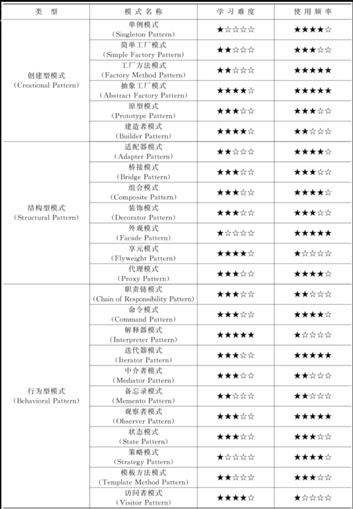

# 第一章 设计模式概述

## 1.1 设计模式的由来

​	软件工程从建筑领域“偷师学艺”，四人组GoF在1995年总结出23种设计模式。

《设计模式：可复用面向对象软件的基础》

### 1.1.1 软件模式的模式分类

​	设计模式

​	架构模式

​	分析模式

​	过程模式

### 1.1.2 软件模式的基础结构

​	软件模式的基础结构由四块构成：

问题描述

前提条件

解法（关联解法、其他相关模式）

效果

## 1.2  设计模式是什么

### 1.2.1 定义

​	代码设计经验的总结

### 1.2.2 设计模式的组成要素

**模式名称**

**问题**：何时使用模式

目的

**解决方案**：设计模式对的组成部分。（UML类图+核心代码）

**效果**：模式的优缺点以及使用模式时该权衡的问题

### 1.2.3 设计模式的分类

#### 1. 按用途

创建型：描述如何创建对象（5个）

结构型：如何实现类和对象的组合（7个）

行为型：类和对象怎样交互以及怎样分配职责（11个）

#### 2. 按用途

类模式

对象模式

## 1.3 设计模式有什么用

1. 提供成功的、能够实现可维护性复用的设计方案
2. 提供通用的设计词汇和方式，利于沟通
3. 可复用性与可扩展性兼顾
4. 对设计模式文档化，方便交接
5. 有助于更加深入地理解面向对象的编程思想

# 第二章 UML类图与面向对象设计原则

UML类图用于表达模式的结构

面向对象设计原则是评价设计模式的重要依据：

> **常用的7个面向对象设计原则：**
>
> 单一职责原则
>
> 开闭原则
>
> 里氏代换原则
>
> 依赖倒转原则
>
> 接口隔离原则
>
> 合成复用原则
>
> 迪米特法则

## 2.1 UML概述

UML（统一建模语言）

